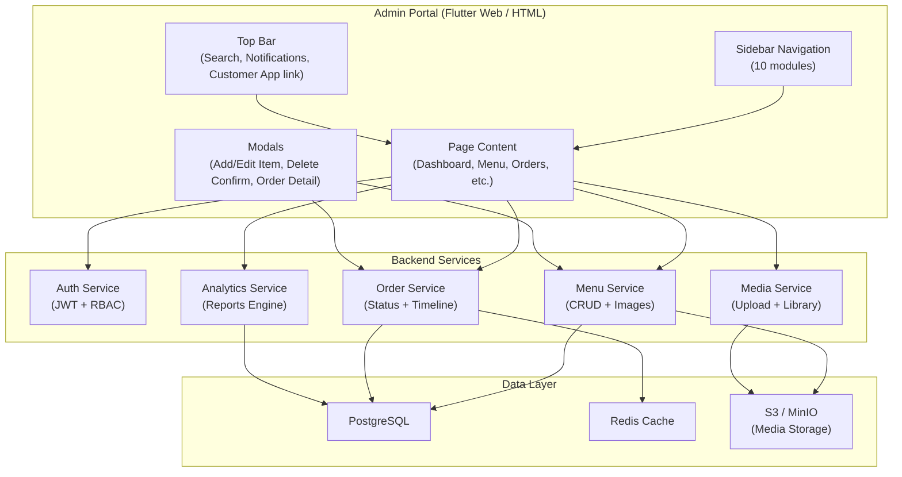
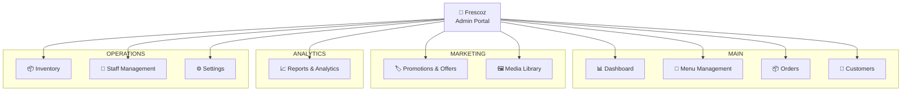
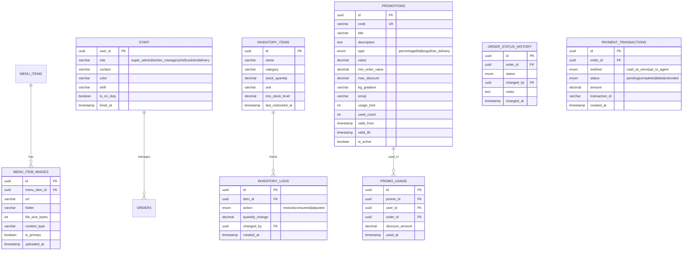
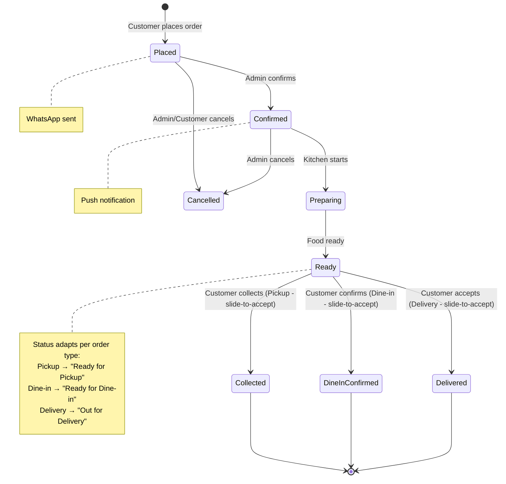
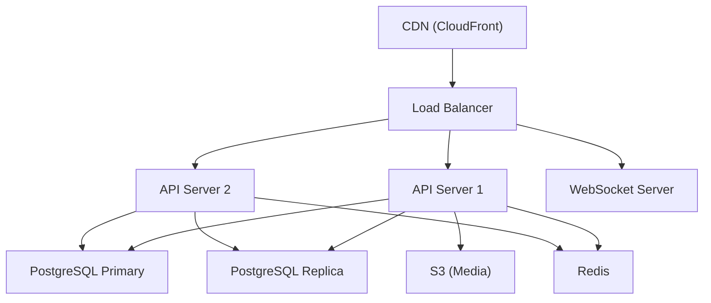

# Fresco's Kitchen — Admin Portal System Design

**Version:** 2.0 · **Date:** 1 March 2026 · **Author:** Engineering Team  
**Companion Document:** [Customer App System Design](./customer_app_system_design.md)

---

## Table of Contents

1. [Overview](#1-overview)
2. [Architecture](#2-architecture)
3. [Module Specifications](#3-module-specifications)
4. [Design System](#4-design-system)
5. [Data Models & Sample Data](#5-data-models--sample-data)
6. [Backend API (Admin Endpoints)](#6-backend-api)
7. [Database Schema (Admin-Specific)](#7-database-schema)
8. [State Management](#8-state-management)
9. [Real-Time Order Management](#9-real-time-order-management)
10. [Reports & Analytics Engine](#10-reports--analytics-engine)
11. [Security & RBAC](#11-security--rbac)
12. [Deployment & Infrastructure](#12-deployment--infrastructure)
13. [Implementation Roadmap](#13-implementation-roadmap)

---

## 1. Overview

The Fresco's Kitchen Admin Portal is a **web-based administration system** providing full operational control over the restaurant ecosystem. An interactive HTML prototype is already built and functional, with a parallel mobile admin panel in Flutter.

### Key Characteristics

| Aspect | Detail |
|--------|--------|
| **Web Prototype** | `prototype/admin.html` + `admin.css` + `admin.js` |
| **Flutter Mobile Admin** | `lib/screens/admin/admin_screen.dart` |
| **Production Target** | Flutter Web (responsive) |
| **Layout** | Dark sidebar (260px collapsible) + light main content |
| **Primary Color** | `#FF6B35` (Fresco's Orange) |
| **Sidebar BG** | `#1A1D23` |
| **Font** | Inter (Google Fonts) |
| **Modules** | 10 full modules |
| **Responsive** | Desktop (1280px+), Tablet (768px+), Mobile (sidebar overlay) |

### Prototype Data Inventory

| Data | Count | Details |
|------|-------|---------|
| Menu Items | **23** | Pizza (4), Japanese (5), Sides (3), Beverages (4), Desserts (4), Combo (3) |
| Orders | **40** | 5 statuses: placed, confirmed, ready, delivered, cancelled · 3 order types: dine-in, pickup, delivery |
| Customers | **15** | Names, phones, order counts, total spent |
| Inventory | **10** | Across 8 categories with stock levels |
| Staff | **6** | Super Admin, Kitchen Manager, Delivery Manager, Cashier, 2 Chefs |
| Promotions | **4** | PIZZABOGO, WELCOME30, COMBO100, FREEDELIVERY |
| Media Files | **12** | Across 4 folders: pizza, toppings, banners, seasonal |

### Prototype File Summary

| File | Lines | Size | Responsibilities |
|------|-------|------|-----------------|
| `admin.html` | ~1,316 | — | Layout: sidebar, topbar, 10 page sections, 3 modals |
| `admin.css` | ~1,080 | — | Design tokens, component styles, animations, responsive |
| `admin.js` | 557 | 46KB | Data generation, rendering, CRUD logic, reports engine |

---

## 2. Architecture

### 2.1 Portal Architecture



### 2.2 Navigation Structure



### 2.3 Sidebar Navigation Badges

| Module | Badge | Meaning |
|--------|-------|---------|
| Menu Management | `23` | Active menu items count |
| Orders | `5` | New/pending orders |
| Inventory | `3` | Low-stock items |

---

## 3. Module Specifications

### 3.1 Dashboard

**Purpose**: At-a-glance overview of restaurant operations.

| Component | Data | Source (admin.js) |
|-----------|------|-------------------|
| **KPI Card: Revenue** | ₹48,520 (↑12.5%) | Computed from orders |
| **KPI Card: Orders** | 127 (↑8.3%) | Order count |
| **KPI Card: Customers** | 342 (↑3.1%) | Customer count |
| **KPI Card: Avg. Order** | ₹382 (↓2.1%) | Revenue / orders |
| **Revenue Trend Chart** | 7-day bar chart | Mon–Sun values |
| **Popular Items** | Top 6 items ranked | Sorted by `orders` field |
| **Recent Orders Table** | Last 8 orders | id, customer, items, total, status, time |
| **Status Donut Chart** | 5-segment SVG donut | placed/confirmed/ready/delivered/cancelled |

**Key Functions**: `renderDashboard()`, `renderRevenueChart()`, `renderPopularItems()`, `renderRecentOrders()`, `renderStatusChart()`

### 3.2 Menu Management

**Purpose**: Full CRUD for all menu items.

| Feature | Implementation |
|---------|---------------|
| **View** | Grid of colored cards (7 per row on desktop) |
| **Category Filters** | Pills: All Items (23), Pizzas, Sides, Japanese, Beverages, Desserts, Combos |
| **Search** | Real-time text filter by item name |
| **Add Item** | Modal with: name (char counter), description (char counter), price, category dropdown, icon selector, veg/non-veg radio, color picker (10 swatches), image upload zone |
| **Image Upload** | Drag & drop zone, click to browse, simulated progress bar (0-100%), FileReader preview |
| **Pizza Options** | Conditional section (shown when category=pizza): size variants, topping add-ons |
| **Edit Item** | Same modal, pre-populated with existing data |
| **Soft Delete** | Confirmation modal showing order count impact → sets `active: false` |
| **Card Display** | Gradient header (item color), Material icon, veg badge, name, description, price, category label |
| **Card Actions** | Edit (primary), View (outline), Delete (danger icon) |

**Key Functions**: `renderAdminMenu()`, `filterMenu(cat)`, `searchMenuItems()`, `openAddItemModal()`, `openEditItemModal(id)`, `saveMenuItem()`, `openDeleteModal(id)`, `confirmDeleteItem()`, `handleImageUpload(input)`, `selectColor(el)`, `togglePizzaOptions()`

### 3.3 Orders

**Purpose**: Complete order management with status tracking.

| Feature | Implementation |
|---------|---------------|
| **Table Columns** | Checkbox, Order ID, Customer (name + phone), Items, Total, Order Type, Payment, Status, Date/Time, Actions |
| **Status Filters** | Pills: All, New (`placed`), Confirmed, Ready, Collected/Delivered (`delivered`), Cancelled |
| **Search** | By Order ID or customer name |
| **Date Filter** | Date picker input |
| **Bulk Selection** | Master checkbox toggles all |
| **Order Detail Modal** | Two-column layout: Left (Order info + Customer info), Right (Items list + order type + payment + total + timeline) |
| **Timeline** | Adapts per order type: Order Placed → Confirmed → Ready for Pickup/Dine-in/Out for Delivery → Collected/Confirmed/Delivered |
| **Print Invoice** | Simulated reprint action |
| **Order ID Format** | `PIZ-YYYYMMDD-NNNN` (e.g., PIZ-20260228-0100) |
| **Order Type Badge** | 🍽️ Dine-in (orange), 🛍️ Pickup (teal), 🚚 Delivery (blue) |
| **Payment Badge** | 💵 Cash at Store (dine-in/pickup), 📱 UPI to Agent (delivery) |

**Key Functions**: `renderOrdersTable()`, `filterOrders(status)`, `searchOrders()`, `openOrderDetail(orderId)`, `closeOrderDetail()`, `reprintInvoice()`

### 3.4 Customers

**Purpose**: Customer directory with spending analytics.

| Column | Data |
|--------|------|
| Name | Avatar initials + full name |
| Phone | Indian mobile format |
| Orders | Total order count |
| Spent | Total ₹ spent (formatted) |
| Last Order | Relative date |
| Status | Active/Inactive badge |

**Actions**: CSV export button

**Key Functions**: `renderCustomers()`, `exportCustomers()`

### 3.5 Promotions & Offers

**Purpose**: Coupon and offer management.

| Promo | Code | Description | Valid Till |
|-------|------|-------------|-----------|
| BOGO Pizza Saturday | `PIZZABOGO` | Buy 1 Get 1 Free on medium pizzas | 2026-03-31 |
| New User Welcome | `WELCOME30` | Flat 30% off first order | 2026-12-31 |
| Combo Special | `COMBO100` | ₹100 off on combos above ₹599 | 2026-04-15 |
| Free Delivery Week | `FREEDELIVERY` | Free delivery on all orders | 2026-03-07 |

**Display**: Gradient banner cards with emoji icons, code badge, validity label.

**Key Functions**: `renderPromos()`, `openPromoModal()`

### 3.6 Media Library

**Purpose**: Centralized asset management for menu images and banners.

| Folder | Files | Examples |
|--------|-------|---------|
| `pizza` | 5 | margherita.jpg, pepperoni.jpg, sushi_roll.jpg |
| `toppings` | 3 | extra_cheese.png, mushrooms.png, jalapenos.png |
| `banners` | 3 | summer_banner.jpg, bogo_offer.jpg, combo_banner.jpg |
| `seasonal` | 1 | diwali_special.jpg |

**Features**: Folder-based filtering pills, media cards with gradient thumbnail + file info, upload button.

**Key Functions**: `renderMedia(filter)`, `filterMedia(f)`, `openMediaUpload()`

### 3.7 Reports & Analytics

**Purpose**: Comprehensive sales reporting across 6 time periods.

| Period | Chart Labels | Table Columns |
|--------|-------------|---------------|
| **Daily** | 8AM–7PM (hourly) | Hour, Orders, Revenue, Avg. Value, Top Item |
| **Weekly** | Mon–Sun | Day, Orders, Revenue, Avg. Value, Growth |
| **Monthly** | Week 1–4 | Week, Orders, Revenue, Avg. Value, Top Category |
| **Quarterly** | Jan–Mar | Month, Orders, Revenue, Growth, Top Item |
| **Half-Yearly** | Oct–Mar (6 months) | Month, Orders, Revenue, Avg. Value, YoY Growth |
| **Annual** | Apr–Mar (12 months) | Month, Orders, Revenue, Growth, Highlight |

**Components per period**:
- 4 KPI cards (Revenue, Orders, Avg. Order, Growth metric)
- Bar chart with value labels
- Detailed breakdown table
- Top 5 performers list (ranked with gold/silver/bronze)
- PDF + CSV export buttons

**Key Functions**: `switchReport(period)`, `getReportData(period)`, `exportReport(format)`

### 3.8 Inventory

**Purpose**: Stock tracking and reorder management.

| Item | Category | Stock | Unit | Status |
|------|----------|-------|------|--------|
| Mozzarella Cheese | Dairy | 85 | kg | In Stock |
| Pizza Dough | Base | 120 | pcs | In Stock |
| Tomato Sauce | Sauce | 45 | L | In Stock |
| Pepperoni | Meat | 12 | kg | Low Stock |
| Fresh Basil | Herbs | 8 | bunches | Low Stock |
| Chicken Breast | Meat | 25 | kg | Moderate |
| Sushi Rice | Grain | 60 | kg | In Stock |
| Salmon Fillet | Seafood | 5 | kg | Low Stock |
| Ramen Noodles | Noodles | 90 | packs | In Stock |
| Coffee Beans | Beverage | 30 | kg | Moderate |

**Stock Level Thresholds**: High (>50) = green bar, Medium (16-50) = blue bar, Low (≤15) = red bar

**Features**: Progress bar visualization, color-coded status badges, restock action buttons, low-stock alerts button (badge: 3 items)

**Key Functions**: `renderInventory()`, `showLowStock()`, `openRestockModal()`

### 3.9 Staff Management

**Purpose**: Team directory and role management.

| Name | Role | Contact | Avatar Color |
|------|------|---------|-------------|
| Sanni Kumar | Super Admin | sanni@frescoz.com | `#FF6B35` |
| Priya Sharma | Kitchen Manager | priya@frescoz.com | `#6366F1` |
| Rahul Verma | Delivery Manager | rahul@frescoz.com | `#10B981` |
| Anita Das | Cashier | anita@frescoz.com | `#F59E0B` |
| Vikram Singh | Chef | vikram@frescoz.com | `#EF4444` |
| Sneha Patel | Chef | sneha@frescoz.com | `#8B5CF6` |

**Display**: Card grid with colored avatar (initials), role badge, contact, Edit + Schedule buttons.

**Key Functions**: `renderStaff()`, `openStaffModal()`

### 3.10 Settings

**Purpose**: Restaurant configuration.

| Section | Fields |
|---------|--------|
| Store Info | Name, address, phone, email, logo |
| Delivery Config | Default time (25-30 min), delivery charge (₹30), free delivery threshold (₹500) |
| Payment Methods | Cash at Store (dine-in/pickup), UPI to Delivery Agent (delivery) |
| Order Types | Dine-in, Self Pickup, Delivery — toggle availability per type |
| Address Requirement | Delivery address only required for Delivery orders; hidden for Dine-in and Pickup |
| Operating Hours | Monday–Sunday open/close times |

---

## 4. Design System

### 4.1 Color Palette

| Token | Value | Usage |
|-------|-------|-------|
| `--primary` | `#FF6B35` | Buttons, links, active states, KPI accent |
| `--primary-light` | `#FF8F65` | Hover states, chart secondary |
| `--primary-bg` | `#FFF5F0` | Light primary background |
| `--sidebar-bg` | `#1A1D23` | Sidebar background |
| `--sidebar-text` | `#9CA3AF` | Sidebar inactive text |
| `--surface` | `#FFFFFF` | Cards, modals |
| `--background` | `#F4F6F9` | Page background |
| `--text-primary` | `#1A1D23` | Headings, bold text |
| `--text-secondary` | `#6B7280` | Labels, hints |
| `--text-hint` | `#9CA3AF` | Placeholder text |
| `--divider` | `#E5E7EB` | Borders, separators |
| `--success` | `#10B981` | Active, delivered, in-stock |
| `--warning` | `#F59E0B` | Moderate, preparing |
| `--error` | `#EF4444` | Cancelled, low-stock, delete |
| `--info` | `#3B82F6` | New orders, info badges |

### 4.2 Typography

| Style | Weight | Size | Usage |
|-------|--------|------|-------|
| Heading 1 | 800 | 28px | Page titles |
| Heading 2 | 700 | 20px | Section titles |
| Heading 3 | 600 | 16px | Card titles |
| Body | 400 | 14px | Table cells, descriptions |
| Small | 400 | 12px | Labels, hints, badges |
| Label | 600 | 12px | Button text, pills |

### 4.3 Components

| Component | Spec |
|-----------|------|
| **Cards** | 12px radius, 1px #E5E7EB border, subtle box-shadow |
| **Pills/Chips** | 20px radius, filled active (primary bg), outline inactive |
| **Status Badges** | Dot + label, color-coded per status |
| **Buttons (primary)** | Primary bg, white text, 8px radius, hover darken |
| **Buttons (outline)** | 1px border, text color, transparent bg |
| **Buttons (danger)** | Red bg/border, icon only or with text |
| **Modals** | Centered, backdrop overlay, max-width 720px, slide-in animation |
| **Toast** | Fixed bottom-right, icon + message, 3s auto-dismiss |
| **Tables** | Header bg #F9FAFB, hover row highlight, zebra optional |
| **Charts** | CSS bar charts with gradient fills, value labels on top |
| **Donut Chart** | SVG circles with stroke-dasharray, center text |

---

## 5. Data Models & Sample Data

### 5.1 Admin Menu Item (Extended)

```javascript
// Fields beyond the customer MenuItem
{
  active: true,      // Soft-delete flag (false = deactivated)
  orders: 156,       // Total orders for this item
  revenue: 31044,    // Total revenue from this item
}
```

### 5.2 Admin Order

```javascript
{
  id: 'PIZ-20260228-0100',
  customer: 'Rahul S.',
  phone: '+91 98765 43210',
  items: [{name: 'Family Feast', qty: 1, price: 1499}],
  total: 1529,              // items total + ₹30 delivery
  status: 'placed',         // placed|confirmed|ready|delivered|cancelled
  orderType: 'pickup',      // 'dinein' | 'pickup' | 'delivery'
  payment: 'Cash at Store', // 'Cash at Store' (dinein/pickup) or 'UPI to Delivery Agent' (delivery)
  address: null,            // Only populated for delivery orders
  date: Date,
  timeline: [{status: 'placed', time: Date}, {status: 'confirmed', time: Date}]
}
```

### 5.3 Customer Record

```javascript
{
  name: 'Rahul S.',
  phone: '+91 98765 43210',
  orders: 12,           // Total order count
  spent: 4800,          // Total ₹ spent
  lastOrder: Date,      // Last order timestamp
  status: 'active'      // active|inactive
}
```

### 5.4 Inventory Item

```javascript
{
  name: 'Mozzarella Cheese',
  cat: 'Dairy',
  stock: 85,
  unit: 'kg',
  lastRestock: '2026-02-25'
}
```

### 5.5 Staff Member

```javascript
{
  name: 'Sanni Kumar',
  role: 'Super Admin',
  contact: 'sanni@frescoz.com',
  color: '#FF6B35'      // Avatar background color
}
```

---

## 6. Backend API

### 6.1 Admin Authentication

All admin endpoints require `Authorization: Bearer <admin_jwt>` with role = `admin`.

### 6.2 Menu Management API

| Method | Endpoint | Description |
|--------|----------|-------------|
| `GET` | `/admin/menu/items` | All items (including inactive) |
| `POST` | `/admin/menu/items` | Create new item |
| `PUT` | `/admin/menu/items/:id` | Update item |
| `DELETE` | `/admin/menu/items/:id` | Soft-delete (set is_deleted=true) |
| `POST` | `/admin/menu/items/:id/restore` | Restore soft-deleted item |
| `POST` | `/admin/menu/items/:id/image` | Upload item image |
| `GET` | `/admin/menu/categories` | List all categories |
| `POST` | `/admin/menu/categories` | Create category |
| `PUT` | `/admin/menu/categories/:id` | Update category |

**Create/Update Item Request:**
```json
{
  "name": "Margherita Pizza",
  "description": "Classic hand-tossed pizza...",
  "price": 199,
  "category": "pizza",
  "icon": "local_pizza",
  "color": "#E53935",
  "is_veg": true,
  "is_available": true,
  "size_options": [
    {"label": "Small (7\")", "size_code": "small", "price_addon": 0},
    {"label": "Medium (10\")", "size_code": "medium", "price_addon": 50},
    {"label": "Large (13\")", "size_code": "large", "price_addon": 100}
  ],
  "topping_options": [
    {"name": "Extra Cheese", "price": 40, "is_veg": true, "category": "cheese"}
  ]
}
```

### 6.3 Order Management API

| Method | Endpoint | Description |
|--------|----------|-------------|
| `GET` | `/admin/orders` | All orders (with filters) |
| `GET` | `/admin/orders/:id` | Full order detail |
| `PUT` | `/admin/orders/:id/status` | Update status |
| `GET` | `/admin/orders/stats` | Order statistics |

**Query Parameters**: `?status=placed&search=PIZ-2026&date=2026-03-01&page=1&limit=20`

**Update Status:**
```json
{
  "status": "confirmed",
  "notes": "Order verified and sent to kitchen"
}
```

### 6.4 Customer Management API

| Method | Endpoint | Description |
|--------|----------|-------------|
| `GET` | `/admin/customers` | All customers with stats |
| `GET` | `/admin/customers/:id` | Detail + order history |
| `PUT` | `/admin/customers/:id` | Update status |
| `GET` | `/admin/customers/export` | CSV export |

### 6.5 Analytics API

| Method | Endpoint | Description |
|--------|----------|-------------|
| `GET` | `/admin/analytics/dashboard` | 4 KPI values |
| `GET` | `/admin/analytics/revenue?period=weekly` | Revenue trend data |
| `GET` | `/admin/analytics/popular-items?limit=6` | Top items |
| `GET` | `/admin/analytics/reports/:period` | Full report data |
| `GET` | `/admin/analytics/reports/:period/export?format=pdf` | Export report |

**Period values**: `daily`, `weekly`, `monthly`, `quarterly`, `halfyearly`, `annual`

**Response: Dashboard KPIs**
```json
{
  "revenue": {"value": 48520, "change_pct": 12.5, "trend": "up"},
  "orders": {"value": 127, "change_pct": 8.3, "trend": "up"},
  "customers": {"value": 342, "change_pct": 3.1, "trend": "up"},
  "avg_order": {"value": 382, "change_pct": -2.1, "trend": "down"}
}
```

### 6.6 Promotion API

| Method | Endpoint | Description |
|--------|----------|-------------|
| `GET` | `/admin/promotions` | All promos |
| `POST` | `/admin/promotions` | Create promo |
| `PUT` | `/admin/promotions/:id` | Update promo |
| `DELETE` | `/admin/promotions/:id` | Deactivate |

### 6.7 Media Library API

| Method | Endpoint | Description |
|--------|----------|-------------|
| `GET` | `/admin/media` | List media files |
| `GET` | `/admin/media?folder=pizza` | Filter by folder |
| `POST` | `/admin/media/upload` | Upload file(s) — multipart |
| `DELETE` | `/admin/media/:id` | Delete file |
| `GET` | `/admin/media/folders` | List folders |

### 6.8 Inventory API

| Method | Endpoint | Description |
|--------|----------|-------------|
| `GET` | `/admin/inventory` | All items with stock |
| `PUT` | `/admin/inventory/:id` | Update stock |
| `POST` | `/admin/inventory/:id/restock` | Record restock |
| `GET` | `/admin/inventory/low-stock` | Items below threshold |

### 6.9 Staff API

| Method | Endpoint | Description |
|--------|----------|-------------|
| `GET` | `/admin/staff` | All staff members |
| `POST` | `/admin/staff` | Add staff |
| `PUT` | `/admin/staff/:id` | Update role/details |
| `DELETE` | `/admin/staff/:id` | Remove staff |

---

## 7. Database Schema

### 7.1 Admin-Specific Tables



### 7.2 Analytics Views

```sql
-- Materialized view for dashboard KPIs
CREATE MATERIALIZED VIEW daily_analytics AS
SELECT
    DATE(created_at) as date,
    COUNT(*) as order_count,
    SUM(total) as revenue,
    AVG(total) as avg_order_value,
    COUNT(DISTINCT customer_id) as unique_customers
FROM orders
WHERE status = 'delivered'
GROUP BY DATE(created_at);

-- Refresh every 15 minutes
REFRESH MATERIALIZED VIEW CONCURRENTLY daily_analytics;

-- Popular items view
CREATE MATERIALIZED VIEW popular_items AS
SELECT
    mi.id, mi.name, mi.category, mi.icon, mi.color,
    COUNT(oi.id) as order_count,
    SUM(oi.line_total) as total_revenue
FROM menu_items mi
JOIN order_items oi ON mi.id = oi.menu_item_id
JOIN orders o ON oi.order_id = o.id AND o.status = 'delivered'
GROUP BY mi.id, mi.name, mi.category, mi.icon, mi.color
ORDER BY order_count DESC;
```

---

## 8. State Management

### 8.1 Admin Providers (Flutter Web)

```dart
MultiProvider(providers: [
  ChangeNotifierProvider(create: (_) => AdminAuthProvider()),
  ChangeNotifierProvider(create: (_) => AdminMenuProvider()),
  ChangeNotifierProvider(create: (_) => AdminOrderProvider()),
  ChangeNotifierProvider(create: (_) => CustomerListProvider()),
  ChangeNotifierProvider(create: (_) => AnalyticsProvider()),
  ChangeNotifierProvider(create: (_) => PromotionProvider()),
  ChangeNotifierProvider(create: (_) => MediaLibraryProvider()),
  ChangeNotifierProvider(create: (_) => InventoryProvider()),
  ChangeNotifierProvider(create: (_) => StaffProvider()),
])
```

### 8.2 Provider Specifications

```dart
class AdminMenuProvider extends ChangeNotifier {
  List<AdminMenuItem> _items = [];
  String _categoryFilter = 'all';
  String _searchQuery = '';

  Future<void> fetchItems();
  Future<void> createItem(AdminMenuItem item);
  Future<void> updateItem(String id, AdminMenuItem item);
  Future<void> softDeleteItem(String id);
  Future<void> restoreItem(String id);
  Future<String> uploadImage(File image);
  List<AdminMenuItem> get filteredItems;
}

class AdminOrderProvider extends ChangeNotifier {
  List<AdminOrder> _orders = [];
  String _statusFilter = 'all';
  String _searchQuery = '';

  Future<void> fetchOrders();
  Future<void> updateStatus(String id, String status);
  AdminOrder? getOrderById(String id);
  Map<String, int> get statusCounts;
}

class AnalyticsProvider extends ChangeNotifier {
  DashboardKPIs? _kpis;
  ReportData? _currentReport;

  Future<void> fetchDashboard();
  Future<void> fetchReport(String period);
  Future<void> exportReport(String period, String format);
}
```

---

## 9. Real-Time Order Management

### 9.1 Admin WebSocket Events

| Event | Direction | Payload | Admin Action |
|-------|-----------|---------|-------------|
| `order:new` | Server → Admin | Full order object | Show notification badge, add to table |
| `order:status_changed` | Server → Admin | `{order_id, status, by}` | Update table row |
| `kitchen:queue` | Server → Admin | `{queue_length, avg_wait}` | Update dashboard |

### 9.2 Order Status Workflow



### 9.3 Admin Order Card Actions

From `admin_screen.dart` — the existing Flutter admin provides:

| Current Status | Action Button | Next Status |
|----------------|--------------|-------------|
| Placed | "Confirm Order" | Confirmed |
| Confirmed | "Start Preparing" | Preparing |
| Preparing | "Mark Ready for Pickup" / "Mark Ready for Dine-in" / "Mark Out for Delivery" | Ready |
| Ready | "Mark Collected" / "Mark Dine-in Confirmed" / "Mark Delivered" | Delivered |
| Any (not completed) | "Cancel" (outline red) | Cancelled |

---

## 10. Reports & Analytics Engine

### 10.1 Report Data Structure

```javascript
// Each period returns this shape
{
  kpis: [
    {label: 'Revenue', value: '₹48,520', change: '↑ 12.5%', trend: 'up'},
    {label: 'Orders', value: '127', change: '↑ 8.3%', trend: 'up'},
    ...
  ],
  chartTitle: 'Hourly Breakdown — Today',
  chartLabels: ['8AM', '9AM', ...],
  chartValues: [1200, 3400, ...],
  tableTitle: 'Hourly Details',
  tableCols: ['Hour', 'Orders', 'Revenue', 'Avg. Value', 'Top Item'],
  tableRows: [['8-9 AM', '3', '₹1,200', '₹400', 'Margherita'], ...]
}
```

### 10.2 Report KPI Summary

| Period | Revenue | Orders | Avg. Order | Highlight |
|--------|---------|--------|-----------|-----------|
| Daily | ₹48,520 | 127 | ₹382 | New Customers: 18 |
| Weekly | ₹2,84,720 | 756 | ₹377 | New Customers: 89 |
| Monthly | ₹8,38,000 | 2,197 | ₹381 | Customer Growth: +342 |
| Quarterly | ₹24,68,000 | 6,467 | ₹382 | Retention Rate: 78% |
| Half-Yearly | ₹43,58,000 | 11,422 | ₹381 | Active Customers: 1,245 |
| Annual | ₹71,48,000 | 18,720 | ₹382 | Total Customers: 2,890 |

### 10.3 Export Formats

| Format | Content | Library |
|--------|---------|---------|
| **PDF** | Formatted report with charts, tables, KPIs | pdfmake / jsPDF |
| **CSV** | Raw data tables, one sheet per section | Native CSV generation |

---

## 11. Security & RBAC

### 11.1 Role-Based Access Control

| Resource | Customer | Staff | Kitchen Mgr | Admin |
|----------|----------|-------|-------------|-------|
| Dashboard | ❌ | ❌ | ✅ read | ✅ |
| Menu (read) | ✅ | ✅ | ✅ | ✅ |
| Menu (write) | ❌ | ❌ | ❌ | ✅ |
| All Orders | ❌ | ✅ assigned | ✅ | ✅ |
| Update Order Status | ❌ | ❌ | ✅ | ✅ |
| Customer Data | Own only | ❌ | ❌ | ✅ |
| Analytics/Reports | ❌ | ❌ | ❌ | ✅ |
| Inventory | ❌ | ✅ read | ✅ | ✅ |
| Staff Mgmt | ❌ | ❌ | ❌ | ✅ |
| Settings | ❌ | ❌ | ❌ | ✅ |
| Media Library | ❌ | ❌ | ❌ | ✅ |
| Promotions | ❌ | ❌ | ❌ | ✅ |

### 11.2 Admin Security Measures

| Layer | Implementation |
|-------|---------------|
| Authentication | JWT with role claim = 'admin' |
| Session timeout | 8 hours for admin portal |
| Audit logging | All CRUD operations logged with user_id + timestamp |
| Input validation | Server-side Joi/Zod schemas on all admin endpoints |
| Image upload | Max 5MB, PNG/JPG/WebP only, virus scan |
| CORS | Admin portal origin whitelisted |
| Rate limiting | 200 req/min for admin endpoints |
| Soft delete | Menu items and promos deactivated, not removed |

---

## 12. Deployment & Infrastructure

### 12.1 Admin Portal Deployment

| Environment | Platform | URL |
|-------------|----------|-----|
| Development | Local dev server | `localhost:8090/admin.html` |
| Staging | Vercel / Netlify | `admin-staging.frescoskitchen.com` |
| Production | CloudFront + S3 | `admin.frescoskitchen.com` |

### 12.2 Infrastructure for Admin



### 12.3 Performance Targets

| Metric | Target |
|--------|--------|
| Dashboard load | < 1 second |
| Table rendering (40 orders) | < 200ms |
| Report generation | < 2 seconds |
| Image upload (5MB) | < 5 seconds |
| WebSocket latency | < 100ms |

---

## 13. Implementation Roadmap

### Phase 1 — Core Admin (Weeks 1-3)

| Task | Priority |
|------|----------|
| Convert admin.html prototype to Flutter Web | 🔴 Critical |
| Admin auth + JWT with role checks | 🔴 Critical |
| Menu CRUD API + image upload to S3 | 🔴 Critical |
| AdminMenuProvider + AdminOrderProvider | 🔴 Critical |
| Dashboard with live KPIs | 🟡 High |

### Phase 2 — Orders & Real-time (Weeks 4-5)

| Task | Priority |
|------|----------|
| Order management table + status updates | 🔴 Critical |
| WebSocket for live order notifications | 🔴 Critical |
| Order detail modal with timeline | 🟡 High |
| Customer management module | 🟡 High |
| WhatsApp notification on status change | 🟡 High |

### Phase 3 — Analytics & Content (Weeks 6-8)

| Task | Priority |
|------|----------|
| Reports engine (6 periods) | 🟡 High |
| PDF/CSV export | 🟢 Medium |
| Media library with S3 integration | 🟢 Medium |
| Promotions CRUD | 🟢 Medium |
| Inventory management | 🟢 Medium |
| Staff management | 🟢 Medium |

### Phase 4 — Polish (Weeks 9-10)

| Task | Priority |
|------|----------|
| Responsive design (tablet + desktop) | 🟡 High |
| Settings module | 🟢 Medium |
| Audit logging | 🟡 High |
| Security audit | 🔴 Critical |
| Performance optimization | 🟡 High |

---

> **Prototype Reference**: [prototype/admin.html](../prototype/admin.html) — Live at `http://localhost:8090/admin.html`  
> **Flutter Admin**: [lib/screens/admin/admin_screen.dart](../lib/screens/admin/admin_screen.dart)  
> **Companion**: [Customer App System Design](./customer_app_system_design.md)
