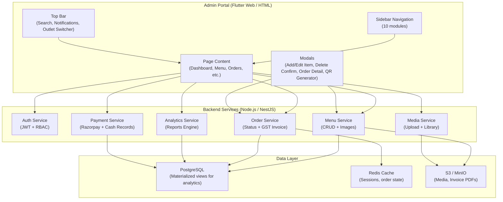
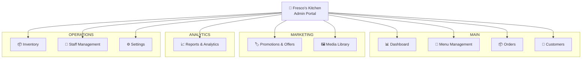
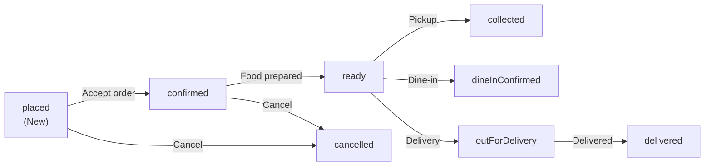
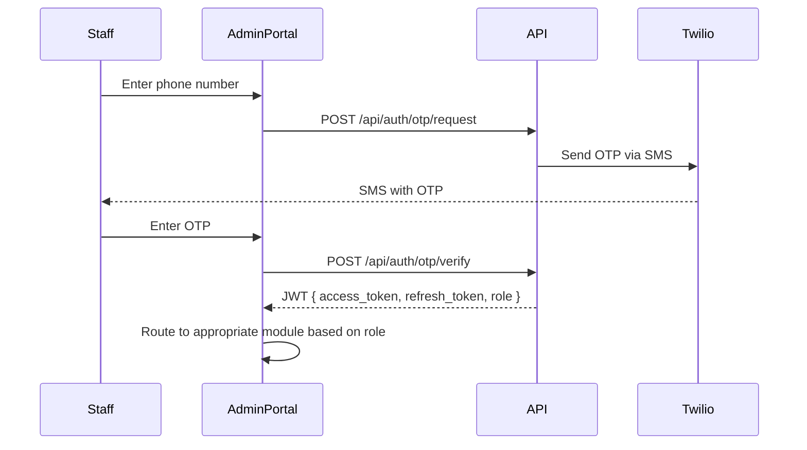
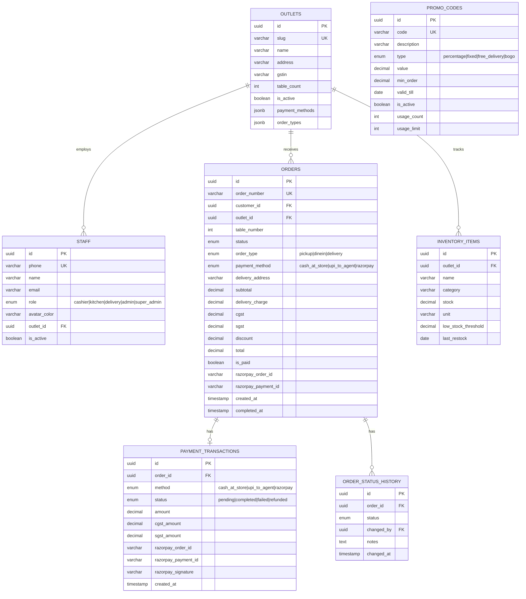
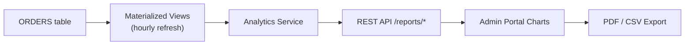
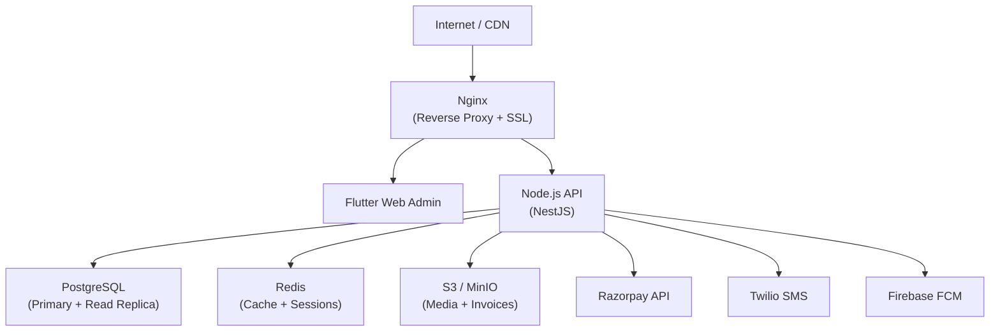

# Fresco's Kitchen — Admin Portal System Design

**Version:** 3.0 · **Date:** 6 March 2026 · **Author:** Engineering Team  
**Companion Document:** [Customer App System Design](./customer_app_system_design.md)

---

## Table of Contents

1. [Overview](#1-overview)
2. [Development Approach](#2-development-approach)
3. [Architecture](#3-architecture)
4. [Module Specifications](#4-module-specifications)
5. [Design System](#5-design-system)
6. [Data Models & Sample Data](#6-data-models--sample-data)
7. [Backend API (Admin Endpoints)](#7-backend-api)
8. [Authentication & RBAC](#8-authentication--rbac)
9. [Database Schema](#9-database-schema)
10. [Real-Time Order Management](#10-real-time-order-management)
11. [Reports & Analytics Engine](#11-reports--analytics-engine)
12. [Security & Infrastructure](#12-security--infrastructure)
13. [Implementation Roadmap](#13-implementation-roadmap)

---

## 1. Overview

The Fresco's Kitchen Admin Portal is a **web-based administration system** providing full operational control over the restaurant ecosystem — menu, orders, customers, inventory, payments, staff, analytics, and multi-outlet management. An interactive HTML prototype is fully functional and approved.

### Key Characteristics

| Aspect | Detail |
|--------|--------|
| **Web Prototype** | `prototype/admin.html` + `admin.css` + `admin.js` |
| **Flutter Mobile Admin** | `lib/screens/admin/admin_screen.dart` |
| **Production Target** | Flutter Web (responsive) |
| **Layout** | Dark sidebar (260px collapsible) + light main content |
| **Primary Color** | `#FF6B35` (Fresco's Orange) |
| **Sidebar BG** | `#1A1D23` |
| **Font** | Inter (Google Fonts) |
| **Modules** | 10 full modules |
| **Responsive** | Desktop (1280px+), Tablet (768px+), Mobile (sidebar overlay) |
| **Multi-Outlet** | Settings and analytics scoped per outlet |
| **GST Compliance** | CGST 1.25% + SGST 1.25% in invoices and reports |
| **QR Management** | Generate/print table QR codes per outlet |

### Prototype Data Inventory

| Data | Count | Details |
|------|-------|---------|
| Menu Items | **23** | Pizza (4), Japanese (5), Sides (3), Beverages (4), Desserts (4), Combo (3) |
| Orders | **40** | 5 statuses · 3 order types: dine-in, pickup, delivery |
| Customers | **15** | Names, phones, order counts, total spent |
| Outlets | **3** | Main Campus, North Block, Central Food Court |
| Inventory | **10** | Across 8 categories with stock levels |
| Staff | **6** | Super Admin, Kitchen Manager, Delivery Manager, Cashier, 2 Chefs |
| Promotions | **4** | PIZZABOGO, WELCOME30, COMBO100, FREEDELIVERY |
| Media Files | **12** | Across 4 folders: pizza, toppings, banners, seasonal |

### Prototype File Summary

| File | Lines | Size | Responsibilities |
|------|-------|------|----------------|
| `admin.html` | ~1,350 | — | Layout: sidebar, topbar, 10 page sections, 3 modals |
| `admin.css` | ~1,080 | — | Design tokens, component styles, animations, responsive |
| `admin.js` | ~600 | ~50KB | Data generation, rendering, CRUD logic, reports engine, QR, invoice reprint |

---

## 2. Development Approach

### 2.1 Phased Development

```
Phase 1: HTML Prototype    ──►  Client approval  ──►  ✅ DONE
Phase 2: Backend APIs      ──►  Build module by module (9 modules)
Phase 3: Flutter Web Admin ──►  Connect to live APIs, replace mock data
Phase 4: Production        ──►  Docker + AWS/GCP, monitoring, CI/CD
```

### 2.2 Monorepo Architecture

```
frescos-app/
├── campus_food_ordering_system/
│   ├── prototype/         # HTML/JS prototypes (customer + admin — approved)
│   ├── docs/              # System design documents
│   ├── lib/               # Flutter (shared customer + admin codebase)
│   │   ├── screens/admin/ # Admin portal Flutter screens
│   │   └── screens/...    # Customer screens
│   └── backend/           # Node.js API server (future)
│       ├── src/auth/
│       ├── src/menu/
│       ├── src/orders/
│       ├── src/payments/
│       ├── src/inventory/
│       ├── src/analytics/
│       ├── src/notifications/
│       └── src/staff/
```

### 2.3 Backend Modules

| # | Module | Admin Responsibilities |
|---|--------|----------------------|
| 1 | **Auth & Authorization** | Staff login, JWT, RBAC role assignment |
| 2 | **User Management** | Customer directory, staff profiles |
| 3 | **Menu & Content** | Full CRUD, image uploads, outlet availability |
| 4 | **Orders** | Status management, GST invoice reprint, timeline tracking |
| 5 | **Inventory** | Stock updates, low-stock alerts, restock logging |
| 6 | **Payments** | Transaction records, Razorpay reconciliation |
| 7 | **Analytics & Reporting** | Daily → Annual reports, materialized views |
| 8 | **Admin Operations** | Outlet config, QR code generation, operating hours |
| 9 | **Notifications** | Broadcast alerts to customers, staff alerts |

---

## 3. Architecture

### 3.1 Portal Architecture



### 3.2 Navigation Structure



### 3.3 Sidebar Navigation Badges

| Module | Badge | Meaning |
|--------|-------|---------|
| Menu Management | `23` | Active menu items count |
| Orders | `5` | New/pending orders |
| Inventory | `3` | Low-stock items requiring reorder |

---

## 4. Module Specifications

### 4.1 Dashboard

**Purpose**: At-a-glance restaurant operations overview.

| Component | Data | Source |
|-----------|------|--------|
| **KPI: Revenue** | ₹48,520 (↑12.5%) | Computed from orders |
| **KPI: Orders** | 127 (↑8.3%) | Order count |
| **KPI: Customers** | 342 (↑3.1%) | Unique customer count |
| **KPI: Avg. Order** | ₹382 (↓2.1%) | Revenue / orders |
| **Revenue Trend Chart** | 7-day bar chart | Mon–Sun values |
| **Popular Items** | Top 6 ranked | sorted by `orders` field |
| **Recent Orders Table** | Last 8 orders | id, customer, items, total, type, status, time |
| **Status Donut Chart** | 5-segment SVG | placed / confirmed / ready / delivered / cancelled |

**Key Functions**: `renderDashboard()`, `renderRevenueChart()`, `renderPopularItems()`, `renderRecentOrders()`, `renderStatusChart()`

### 4.2 Menu Management

**Purpose**: Full CRUD for all menu items across outlets.

| Feature | Implementation |
|---------|---------------|
| **View** | Grid of colored cards |
| **Category Filters** | Pills: All (23), Pizzas, Sides, Japanese, Beverages, Desserts, Combos |
| **Search** | Real-time text filter by item name |
| **Add Item** | Modal: name, description, price, category, icon, veg/non-veg, color picker (10 swatches), image upload |
| **Image Upload** | Drag & drop zone, click to browse, progress bar, FileReader preview |
| **Pizza Options** | Conditional: size variants, topping add-ons (shown when category = pizza) |
| **Edit Item** | Same modal, pre-populated |
| **Soft Delete** | Confirmation modal showing order count impact → sets `active: false` |
| **Card Display** | Gradient header, Material icon, veg badge, name, price, category label |
| **Card Actions** | Edit (primary), View (outline), Delete (danger icon) |

**Key Functions**: `renderAdminMenu()`, `filterMenu(cat)`, `searchMenuItems()`, `openAddItemModal()`, `openEditItemModal(id)`, `saveMenuItem()`, `openDeleteModal(id)`, `confirmDeleteItem()`, `handleImageUpload(input)`, `togglePizzaOptions()`

### 4.3 Orders

**Purpose**: Complete order management with status tracking, GST invoicing, and type-aware actions.

| Feature | Implementation |
|---------|---------------|
| **Table Columns** | Order ID, Customer (name + phone), Items, Total, Order Type, Payment, Status, Date/Time, Actions |
| **Status Filters** | Pills: All, New (`placed`), Confirmed, Ready, Collected/Delivered, Cancelled |
| **Search** | By Order ID or customer name |
| **Date Filter** | Date picker |
| **Order Type Badge** | 🍽️ Dine-in (orange), 🛍️ Pickup (teal), 🚚 Delivery (blue) |
| **Payment Badge** | 💵 Cash at Store (dine-in/pickup), 📱 UPI to Agent (delivery), 💳 Razorpay (online) |
| **Order Detail Modal** | Two-column: order info + timeline (Left), items + GST breakdown + total (Right) |
| **Timeline** | Adapts per type: Placed → Confirmed → Ready for Pickup/Dine-in/Out for Delivery → Collected/Confirmed/Delivered |
| **GST in Detail** | Shows CGST 1.25% + SGST 1.25% on subtotal |
| **Reprint Invoice** | Generates GST-compliant invoice (GSTIN, CGST, SGST, grand total) |
| **Order ID Format** | `PIZ-YYYYMMDD-NNNN` |
| **Admin Actions** | "Mark Ready for Pickup" / "Mark Ready for Dine-in" / "Mark Out for Delivery" (context-aware) |
| **Outlet Filter** | Filter orders by outlet |
| **Table Number** | Shown for QR dine-in orders |

**Key Functions**: `renderOrdersTable()`, `filterOrders(status)`, `searchOrders()`, `openOrderDetail(orderId)`, `closeOrderDetail()`, `reprintInvoice(orderId)`, `updateOrderStatus(orderId, status)`

**Order Status Flow (Admin Actions)**:



### 4.4 Customers

**Purpose**: Customer directory with spending analytics.

| Column | Data |
|--------|------|
| Name | Avatar initials + full name |
| Phone | Indian mobile format |
| Orders | Total order count |
| Spent | Total ₹ spent |
| Last Order | Relative date |
| Status | Active / Inactive badge |

**Actions**: CSV export.  
**Key Functions**: `renderCustomers()`, `exportCustomers()`

### 4.5 Promotions & Offers

| Promo | Code | Description | Valid Till |
|-------|------|-------------|-----------|
| BOGO Pizza Saturday | `PIZZABOGO` | Buy 1 Get 1 Free on medium pizzas | 2026-03-31 |
| New User Welcome | `WELCOME30` | Flat 30% off first order | 2026-12-31 |
| Combo Special | `COMBO100` | ₹100 off combos above ₹599 | 2026-04-15 |
| Free Delivery Week | `FREEDELIVERY` | Free delivery on all orders | 2026-03-07 |

**Key Functions**: `renderPromos()`, `openPromoModal()`

### 4.6 Media Library

| Folder | Files | Examples |
|--------|-------|---------|
| `pizza` | 5 | margherita.jpg, pepperoni.jpg |
| `toppings` | 3 | extra_cheese.png, mushrooms.png |
| `banners` | 3 | summer_banner.jpg, bogo_offer.jpg |
| `seasonal` | 1 | diwali_special.jpg |

**Key Functions**: `renderMedia(filter)`, `filterMedia(f)`, `openMediaUpload()`

### 4.7 Reports & Analytics

**Purpose**: Comprehensive sales reporting with GST-inclusive totals across 6 time periods.

| Period | Chart Labels | Table Columns |
|--------|-------------|---------------|
| **Daily** | 8AM–7PM (hourly) | Hour, Orders, Revenue (incl. GST), Avg. Value, Top Item |
| **Weekly** | Mon–Sun | Day, Orders, Revenue, Avg. Value, Growth |
| **Monthly** | Week 1–4 | Week, Orders, Revenue, Avg. Value, Top Category |
| **Quarterly** | Jan–Mar | Month, Orders, Revenue, Growth, Top Item |
| **Half-Yearly** | Oct–Mar (6 months) | Month, Orders, Revenue, Avg. Value, YoY Growth |
| **Annual** | Apr–Mar (12 months) | Month, Orders, Revenue, Growth, Highlight |

**Components per period**:
- 4 KPI cards (Revenue, Orders, Avg. Order, Growth)
- Bar chart with value labels
- Detailed breakdown table
- Top 5 performers (gold/silver/bronze ranked)
- **GST Summary** (CGST collected + SGST collected per period)
- PDF + CSV export buttons

**Key Functions**: `switchReport(period)`, `getReportData(period)`, `exportReport(format)`

### 4.8 Inventory

**Purpose**: Stock tracking and reorder management.

| Item | Category | Stock | Unit | Status |
|------|----------|-------|------|--------|
| Mozzarella Cheese | Dairy | 85 | kg | In Stock |
| Pizza Dough | Base | 120 | pcs | In Stock |
| Tomato Sauce | Sauce | 45 | L | In Stock |
| Pepperoni | Meat | 12 | kg | Low Stock |
| Fresh Basil | Herbs | 8 | bunches | Low Stock |
| Chicken Breast | Meat | 25 | kg | Moderate |
| Sushi Rice | Grain | 60 | kg | In Stock |
| Salmon Fillet | Seafood | 5 | kg | Low Stock |
| Ramen Noodles | Noodles | 90 | packs | In Stock |
| Coffee Beans | Beverage | 30 | kg | Moderate |

**Thresholds**: High (>50) = green, Medium (16–50) = blue, Low (≤15) = red.  
**Key Functions**: `renderInventory()`, `showLowStock()`, `openRestockModal()`

### 4.9 Staff Management

| Name | Role | Contact | Avatar Color |
|------|------|---------|-------------|
| Sanni Kumar | Super Admin | sanni@frescoz.com | `#FF6B35` |
| Priya Sharma | Kitchen Manager | priya@frescoz.com | `#6366F1` |
| Rahul Verma | Delivery Manager | rahul@frescoz.com | `#10B981` |
| Anita Das | Cashier | anita@frescoz.com | `#F59E0B` |
| Vikram Singh | Chef | vikram@frescoz.com | `#EF4444` |
| Sneha Patel | Chef | sneha@frescoz.com | `#8B5CF6` |

**Key Functions**: `renderStaff()`, `openStaffModal()`

### 4.10 Settings

| Section | Fields |
|---------|--------|
| Store Info | Name, address, phone, email, logo |
| Outlets | Add/edit/deactivate outlets; QR code generator per outlet/table |
| Delivery Config | Default time (25-30 min), delivery charge (₹30), free delivery threshold (₹500) |
| Payment Methods | Cash at Store, UPI to Agent, Razorpay (enable/disable per outlet) |
| GST Config | GSTIN, CGST rate (1.25%), SGST rate (1.25%) |
| Order Types | Dine-in, Self Pickup, Delivery — toggle per outlet |
| Address Requirement | Delivery address only for Delivery orders; hidden for Dine-in and Pickup |
| Operating Hours | Per outlet: Monday–Sunday open/close times |

---

## 5. Design System

### 5.1 Color Palette

| Token | Value | Usage |
|-------|-------|-------|
| `--primary` | `#FF6B35` | Buttons, links, active states, KPI accent |
| `--primary-light` | `#FF8F65` | Hover states, chart secondary |
| `--primary-bg` | `#FFF5F0` | Light primary background |
| `--sidebar-bg` | `#1A1D23` | Sidebar background |
| `--sidebar-text` | `#9CA3AF` | Sidebar inactive text |
| `--surface` | `#FFFFFF` | Cards, modals |
| `--background` | `#F4F6F9` | Page background |
| `--text-primary` | `#1A1D23` | Headings, bold text |
| `--text-secondary` | `#6B7280` | Labels, hints |
| `--text-hint` | `#9CA3AF` | Placeholder text |
| `--divider` | `#E5E7EB` | Borders, separators |
| `--success` | `#10B981` | Active, delivered, in-stock |
| `--warning` | `#F59E0B` | Moderate, preparing |
| `--error` | `#EF4444` | Cancelled, low-stock, delete |
| `--info` | `#3B82F6` | New orders, info badges, Razorpay |

### 5.2 Typography

| Style | Weight | Size | Usage |
|-------|--------|------|-------|
| Heading 1 | 800 | 28px | Page titles |
| Heading 2 | 700 | 20px | Section titles |
| Heading 3 | 600 | 16px | Card titles |
| Body | 400 | 14px | Table cells, descriptions |
| Small | 400 | 12px | Labels, hints, badges |
| Label | 600 | 12px | Button text, pills |

### 5.3 Components

| Component | Spec |
|-----------|------|
| **Cards** | 12px radius, 1px `#E5E7EB` border, subtle box-shadow |
| **Pills/Chips** | 20px radius, filled active (primary bg), outline inactive |
| **Status Badges** | Colored dot + label, per-status color coding |
| **Order Type Badges** | 🍽️ orange (dine-in), 🛍️ teal (pickup), 🚚 blue (delivery) |
| **Payment Badges** | 💵 Cash, 📱 UPI, 💳 Razorpay (blue) |
| **Buttons (primary)** | Primary bg, white text, 8px radius |
| **Buttons (outline)** | 1px border, text color, transparent bg |
| **Buttons (danger)** | Red bg/border |
| **Modals** | Centered, backdrop overlay, max-width 720px, slide-in animation |
| **Toast** | Fixed bottom-right, icon + message, 3s auto-dismiss |
| **Tables** | Header bg `#F9FAFB`, hover row highlight |
| **Charts** | CSS bar charts with gradient fills, value labels on top |
| **Donut Chart** | SVG `stroke-dasharray`, center text |

---

## 6. Data Models & Sample Data

### 6.1 Admin Menu Item

```javascript
{
  id: 'pizza-1',
  name: 'Margherita Pizza',
  description: 'Classic hand-tossed...',
  price: 199,
  category: 'Pizza',
  icon: 'local_pizza',
  isVeg: true,
  active: true,          // Soft-delete flag
  orders: 156,           // Total orders for this item
  revenue: 31044,        // Total revenue from this item
  outletIds: ['main-campus', 'north-block']  // Where item is available
}
```

### 6.2 Admin Order

```javascript
{
  id: 'PIZ-20260306-0100',
  customer: 'Rahul S.',
  phone: '+91 98765 43210',
  outlet: 'main-campus',
  tableNumber: 7,            // Set if QR dine-in order
  items: [{ name: 'Margherita Pizza', qty: 2, price: 199 }],
  subtotal: 398,
  deliveryCharge: 0,
  cgst: 5,                   // subtotal × 1.25%
  sgst: 5,                   // subtotal × 1.25%
  discount: 0,
  total: 408,
  status: 'placed',          // placed|confirmed|ready|collected|dineInConfirmed|outForDelivery|delivered|cancelled
  orderType: 'dinein',       // 'dinein' | 'pickup' | 'delivery'
  payment: 'Cash at Store',  // 'Cash at Store' | 'UPI to Delivery Agent' | 'Razorpay'
  razorpayPaymentId: null,   // Populated for Razorpay orders
  address: null,             // Only for delivery orders
  date: new Date(),
  timeline: [
    { status: 'placed', time: new Date() },
    { status: 'confirmed', time: new Date() }
  ]
}
```

### 6.3 Customer Record

```javascript
{
  name: 'Rahul S.',
  phone: '+91 98765 43210',
  orders: 12,
  spent: 4800,
  lastOrder: new Date(),
  status: 'active'
}
```

### 6.4 Outlet

```javascript
{
  id: 'main-campus',
  name: "Fresco's — Main Campus",
  address: 'Ground Floor, Main Building',
  gstin: '29AABCF1234C1Z5',
  tables: 20,            // For QR table mapping
  isActive: true,
  paymentMethods: ['cash', 'upi', 'razorpay'],
  orderTypes: ['dinein', 'pickup', 'delivery']
}
```

### 6.5 Payment Transaction

```javascript
{
  id: 'txn-001',
  orderId: 'PIZ-20260306-0100',
  method: 'razorpay',        // 'cash_at_store' | 'upi_to_agent' | 'razorpay'
  status: 'completed',       // 'pending' | 'completed' | 'failed' | 'refunded'
  amount: 408,
  cgst: 5,
  sgst: 5,
  razorpayOrderId: 'order_xxx',
  razorpayPaymentId: 'pay_xxx',
  razorpaySignature: 'sig_xxx',
  createdAt: new Date()
}
```

---

## 7. Backend API

### 7.1 Admin Order Endpoints

| Method | Endpoint | Description | Role |
|--------|----------|-------------|------|
| GET | `/api/admin/orders` | List all orders (filter by outlet, status, date) | staff+ |
| GET | `/api/admin/orders/:id` | Order detail with GST breakdown | staff+ |
| PUT | `/api/admin/orders/:id/status` | Update order status | kitchen+ |
| GET | `/api/admin/orders/:id/invoice` | Download GST invoice PDF | staff+ |
| POST | `/api/admin/orders/:id/reprint` | Reprint invoice | staff+ |

### 7.2 Admin Menu Endpoints

| Method | Endpoint | Description | Role |
|--------|----------|-------------|------|
| GET | `/api/admin/menu` | All items including inactive | staff+ |
| POST | `/api/admin/menu` | Create menu item | admin+ |
| PUT | `/api/admin/menu/:id` | Update menu item | admin+ |
| DELETE | `/api/admin/menu/:id` | Soft delete item | admin+ |
| POST | `/api/admin/menu/:id/image` | Upload item image | admin+ |

### 7.3 Reporting Endpoints

| Method | Endpoint | Description | Role |
|--------|----------|-------------|------|
| GET | `/api/admin/reports/daily` | Hourly breakdown, GST summary | admin+ |
| GET | `/api/admin/reports/weekly` | Daily breakdown | admin+ |
| GET | `/api/admin/reports/monthly` | Weekly breakdown | admin+ |
| GET | `/api/admin/reports/quarterly` | Monthly breakdown | admin+ |
| GET | `/api/admin/reports/half-yearly` | 6-month breakdown | admin+ |
| GET | `/api/admin/reports/annual` | 12-month breakdown | admin+ |
| GET | `/api/admin/reports/gst` | GST summary (CGST + SGST collected) | admin+ |
| GET | `/api/admin/reports/export` | Export PDF / CSV | admin+ |

### 7.4 Outlet & QR Endpoints

| Method | Endpoint | Description | Role |
|--------|----------|-------------|------|
| GET | `/api/admin/outlets` | List outlets | staff+ |
| POST | `/api/admin/outlets` | Create outlet | super_admin |
| PUT | `/api/admin/outlets/:id` | Update outlet config | admin+ |
| GET | `/api/admin/outlets/:id/qr/:table` | Get QR code for table | admin+ |
| POST | `/api/admin/outlets/:id/qr/generate` | Generate all table QRs | admin+ |

---

## 8. Authentication & RBAC

### 8.1 Staff Login Flow



### 8.2 Token Strategy

| Token | Lifetime | Purpose |
|-------|---------|---------|
| **Access Token** | 15–30 min | API authentication |
| **Refresh Token** | 30 days | Auto-renew access token |
| **Token Blacklist** | On logout | Prevent reuse (stored in Redis) |

### 8.3 Role-Based Module Access

| Module | customer | cashier | kitchen | delivery | admin | super_admin |
|--------|----------|---------|---------|----------|-------|-------------|
| Dashboard | ❌ | ✅ | ❌ | ❌ | ✅ | ✅ |
| Menu Management | ❌ | 👁️ | 👁️ | ❌ | ✅ | ✅ |
| Orders | ❌ | ✅ | ✅ | ✅ | ✅ | ✅ |
| Customers | ❌ | ❌ | ❌ | ❌ | ✅ | ✅ |
| Promotions | ❌ | ❌ | ❌ | ❌ | ✅ | ✅ |
| Reports | ❌ | ❌ | ❌ | ❌ | ✅ | ✅ |
| Inventory | ❌ | ❌ | ✅ | ❌ | ✅ | ✅ |
| Staff Management | ❌ | ❌ | ❌ | ❌ | ❌ | ✅ |
| Settings | ❌ | ❌ | ❌ | ❌ | ✅ | ✅ |
| GST Invoice | ❌ | ✅ | ❌ | ❌ | ✅ | ✅ |

*👁️ = read-only*

---

## 9. Database Schema

### 9.1 Admin-Specific Tables



### 9.2 Analytics Views (Materialized)

```sql
-- GST collection summary by outlet and period
CREATE MATERIALIZED VIEW mv_gst_summary AS
SELECT
  o.outlet_id,
  DATE_TRUNC('month', o.created_at) AS period,
  SUM(o.subtotal) AS taxable_amount,
  SUM(o.cgst) AS cgst_collected,
  SUM(o.sgst) AS sgst_collected,
  SUM(o.total) AS gross_revenue,
  COUNT(*) AS order_count
FROM orders o
WHERE o.status NOT IN ('cancelled')
GROUP BY o.outlet_id, DATE_TRUNC('month', o.created_at);

-- Refresh schedule: every hour
-- SELECT cron.schedule('refresh-gst', '0 * * * *', 'REFRESH MATERIALIZED VIEW CONCURRENTLY mv_gst_summary');
```

---

## 10. Real-Time Order Management

### 10.1 WebSocket Events (Admin)

| Event | Direction | Payload |
|-------|-----------|---------|
| `order.new` | Server → Admin | `{ order }` — triggers sound + badge +1 |
| `order.status_changed` | Server → Admin | `{ orderId, oldStatus, newStatus }` |
| `order.payment_received` | Server → Admin | `{ orderId, method, amount }` |
| `admin.status_update` | Admin → Server | `{ orderId, newStatus, adminId }` |
| `inventory.low_stock` | Server → Admin | `{ itemId, currentStock }` |

### 10.2 Order Notification Sound

New orders trigger an audible notification in the admin portal (Web Audio API `AudioContext`).

---

## 11. Reports & Analytics Engine

### 11.1 Report Data Flow



### 11.2 GST Report

Every reporting period includes a **GST Summary card**:

| Field | Value |
|-------|-------|
| Taxable Turnover | ₹ subtotal total |
| CGST Collected (1.25%) | ₹ CGST total |
| SGST Collected (1.25%) | ₹ SGST total |
| Total Tax Collected | ₹ GST total |
| Gross Revenue | ₹ grand total |

---

## 12. Security & Infrastructure

### 12.1 Security Measures

| Concern | Implementation |
|---------|---------------|
| Transport | HTTPS everywhere (TLS 1.2+) |
| Authentication | JWT (RS256) + OTP via Twilio |
| OTP storage | Hashed with bcrypt before DB write |
| OTP rate limiting | Max 3 requests / 15 min per phone |
| Input validation | Server-side on all endpoints |
| RBAC | Role claim in JWT, checked every request |
| Razorpay | Signature verified server-side before order confirmation |
| DB connections | SSL encrypted |
| Sensitive ops | Re-authentication required (staff deletion, settings) |

### 12.2 Infrastructure



### 12.3 Deployment Strategy

| Stage | Setup |
|-------|-------|
| **v1 (Launch)** | Docker Compose (nginx, api, postgres, redis) on single VPS / Cloud VM |
| **v2 (Growth)** | Managed DB (RDS/Cloud SQL), Redis (Elasticache), API on ECS / Cloud Run |
| **v3 (Scale)** | Add DB read replicas, CDN for media, horizontal API scaling, Microservices if needed |

### 12.4 CI/CD Pipeline

```
Push to main → GitHub Actions:
  1. Run tests
  2. Build Docker image
  3. Push to ECR / Artifact Registry
  4. Deploy to ECS / Cloud Run
  5. Run DB migrations
  6. Refresh materialized views
  7. Send Slack notification
```

---

## 13. Implementation Roadmap

| Phase | Milestone | Description |
|-------|-----------|-------------|
| ✅ **0** | HTML Prototype approved | `admin.html` + `admin.js` + `admin.css` fully functional |
| 🔄 **1** | Backend — Auth module | Staff OTP login, JWT, RBAC |
| 🔄 **2** | Backend — Menu & Outlets | CRUD, image uploads, outlet management |
| 🔄 **3** | Backend — Orders + GST | Status management, CGST/SGST calculation, invoice generation |
| 🔄 **4** | Backend — Payments | Razorpay integration, transaction records |
| 🔄 **5** | Backend — Analytics | Materialized views, 6-period reporting, GST reports |
| 🔄 **6** | Backend — Inventory & Staff | Stock tracking, staff CRUD, RBAC enforcement |
| 🔄 **7** | Backend — Notifications | FCM push, WhatsApp alerts, admin order sounds |
| 🔄 **8** | Flutter Web Admin | Dashboard, Orders, Menu — connected to live API |
| 🔄 **9** | Flutter Web Admin | Reports, Inventory, Staff, Settings |
| 🔄 **10** | QR Code System | Table QR generation (admin) + table QR scanning (customer app) |
| 🔄 **11** | Production | Docker + AWS/GCP, CI/CD, monitoring, load testing |
