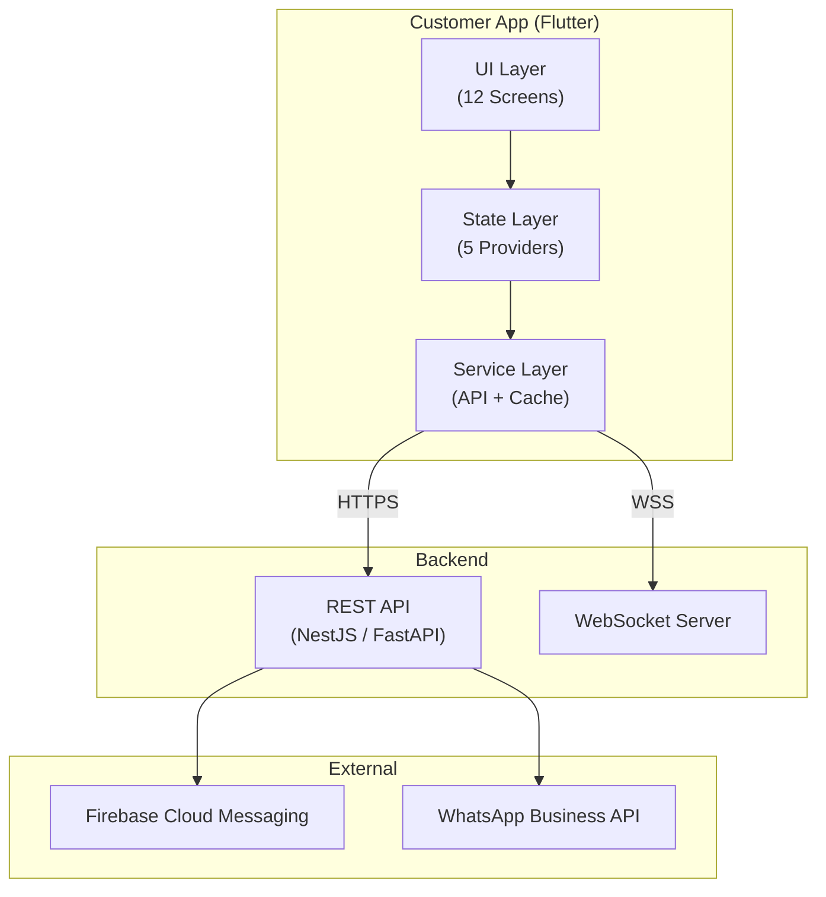
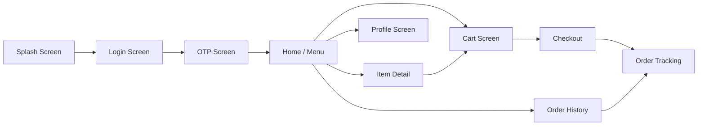
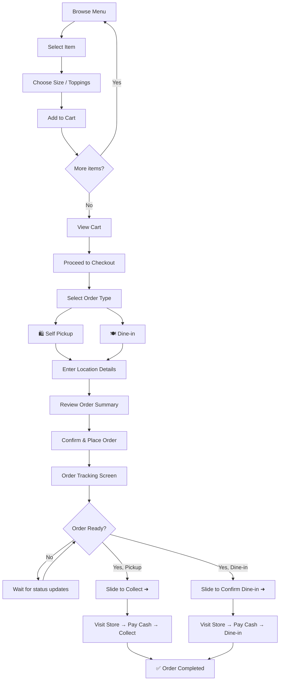
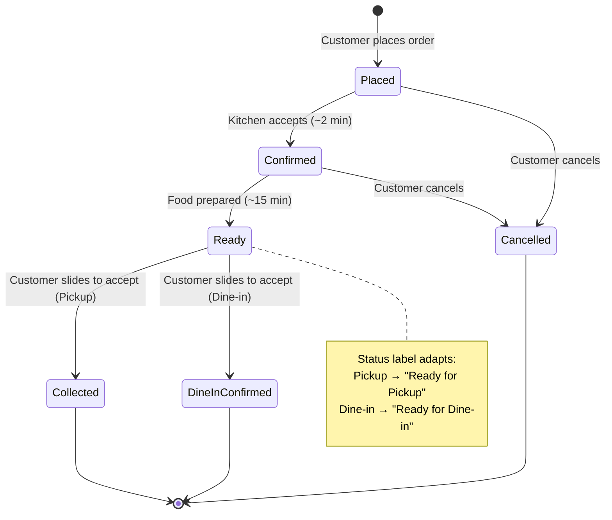
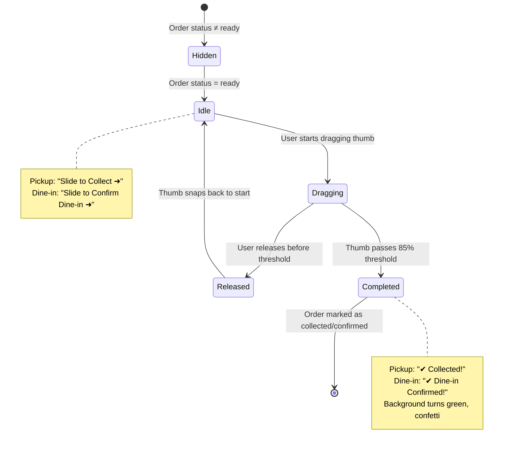
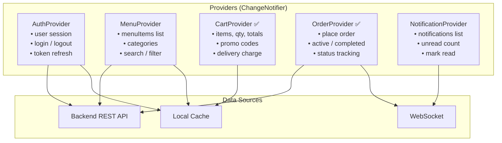
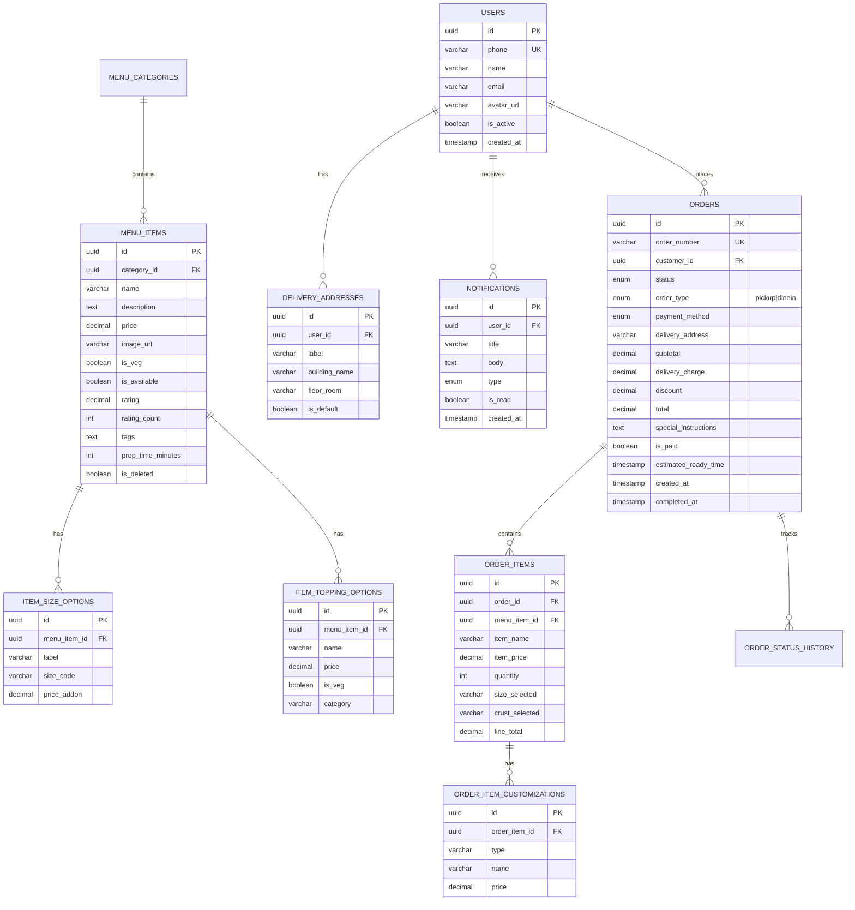
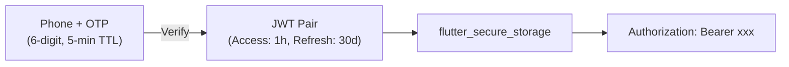

# Fresco's Kitchen — Customer Mobile App System Design

**Version:** 2.0 · **Date:** 1 March 2026 · **Author:** Engineering Team  
**Companion Document:** [Admin Portal System Design](./admin_portal_system_design.md)

---

## Table of Contents

1. [Overview](#1-overview)
2. [Architecture](#2-architecture)
3. [Screen Flow & Navigation](#3-screen-flow--navigation)
4. [Existing Codebase](#4-existing-codebase)
5. [Data Models](#5-data-models)
6. [State Management](#6-state-management)
7. [Feature Specifications](#7-feature-specifications)
8. [Backend API Integration](#8-backend-api-integration)
9. [Database Schema (Customer-Facing)](#9-database-schema)
10. [Real-Time & Notifications](#10-real-time--notifications)
11. [Security](#11-security)
12. [Performance & Deployment](#12-performance--deployment)
13. [Implementation Roadmap](#13-implementation-roadmap)

---

## 1. Overview

The Fresco's Kitchen Customer Mobile App is a **cross-platform Flutter application** (Android + iOS, single codebase) that enables campus students to browse the menu, customize pizza orders, place delivery orders, track in real time, and receive WhatsApp/push notifications.

### Key Characteristics

| Aspect | Detail |
|--------|--------|
| **Framework** | Flutter 3.x (Dart) |
| **Platforms** | Android, iOS |
| **Design System** | Material Design 3 (Material You) |
| **Font** | Inter (Google Fonts) |
| **Primary Color** | `#FF6B35` (Fresco's Orange) |
| **State Management** | Provider (ChangeNotifier) |
| **Prototype** | `prototype/index.html` — 1,316 lines of working JS |
| **Delivery Model** | Self Pickup + Dine-in (both available) |
| **Preparation Time** | 25–30 minutes |
| **Payment** | Cash at Store only (payment gateway planned) |

### Prototype Data Inventory

| Data | Count | Source |
|------|-------|--------|
| Menu Items | 23 | 6 categories: Pizza (4), Japanese (5), Sides (3), Beverages (4), Desserts (4), Combo (3) |
| Category Tabs | 7 | All, Pizzas, Sides, Japanese, Beverages, Desserts, Combo Meals |
| Sample Notifications | 3 | Promo, BOGO, system update |

---

## 2. Architecture

### 2.1 High-Level System Context



### 2.2 Flutter App Layers

```
┌──────────────────────────────────────┐
│          UI Layer (Screens)          │
│  Splash → Login → Home → Detail →   │
│  Cart → Checkout → Tracking → etc   │
├──────────────────────────────────────┤
│       State Layer (Providers)        │
│  AuthProvider · MenuProvider ·       │
│  CartProvider · OrderProvider ·      │
│  NotificationProvider                │
├──────────────────────────────────────┤
│       Service Layer (Data)           │
│  ApiService · WebSocketService ·     │
│  CacheService · NotificationService  │
├──────────────────────────────────────┤
│       Core Layer (Shared)            │
│  AppTheme · AppColors · AppSpacing · │
│  Constants · Utils · WhatsAppHelper  │
└──────────────────────────────────────┘
```

---

## 3. Screen Flow & Navigation

### 3.1 Navigation Graph



### 3.1.1 Order Fulfillment User Flow



### 3.1.2 Order Status State Machine



### 3.1.3 Slide-to-Accept Button States



### 3.2 Bottom Navigation

| Tab | Icon | Screen | Provider |
|-----|------|--------|----------|
| Menu | `restaurant_menu` | HomeScreen | MenuProvider |
| Orders | `receipt_long` | OrderHistoryScreen | OrderProvider |
| Alerts | `notifications` | Notification List | NotificationProvider |
| Profile | `person` | ProfileScreen | AuthProvider |

### 3.3 Screen Inventory

| # | Screen | File | Key Features | Status |
|---|--------|------|-------------|--------|
| 1 | Splash | `splash_screen.dart` | Animated logo, auto-navigate after 2s | ✅ Exists |
| 2 | Login | `login_screen.dart` | Phone number input, country code | ✅ Exists |
| 3 | OTP | `otp_screen.dart` | 6-digit OTP, resend timer, auto-verify | ✅ Exists |
| 4 | Home / Menu | `home_screen.dart` | Category tabs (flex-wrap grid, 7 tabs), search, menu item cards, veg/non-veg badge | ✅ Exists |
| 5 | Item Detail | `menu_item_detail_screen.dart` | Image, description, size picker (S/M/L), toppings checkboxes, crust options, qty stepper, cooking instructions, dynamic price | ✅ Exists |
| 6 | Cart | `cart_screen.dart` | Item list with qty adjustment, subtotal, delivery charge (₹30 if < ₹500), promo code input, grand total | ✅ Exists |
| 7 | Checkout | `checkout_screen.dart` | Order type selection (Pickup/Dine-in), location text field, cooking instructions, order summary | ✅ Exists |
| 8 | Payment | `payment_screen.dart` | Cash at Store (selected), UPI placeholder | ✅ Exists |
| 9 | Order Tracking | `order_tracking_screen.dart` | Status stepper with order-type-aware labels, order type badge, 25-30 min ETA, slide-to-accept | ✅ Exists |
| 10 | Order History | `order_history_screen.dart` | Past orders list, status badges, reorder button | ✅ Exists |
| 11 | Profile | `profile_screen.dart` | Edit name/phone, saved addresses, favorites, help/FAQ, about section | ✅ Exists |
| 12 | Admin (Mobile) | `admin_screen.dart` | Dashboard + Orders tabs (3-tab view) | ✅ Exists |

---

## 4. Existing Codebase

### 4.1 Project Structure

```
lib/
├── app.dart                              # MyApp root widget with MultiProvider
├── main.dart                             # Entry point: runApp(MyApp())
├── injection_container.dart              # Dependency injection setup
├── core/
│   ├── constants/
│   │   ├── app_colors.dart               # 20+ color constants
│   │   └── app_spacing.dart              # xs(4) → xxxl(48) + border radii
│   ├── theme/
│   │   └── app_theme.dart                # Material3 light + dark ThemeData
│   └── utils/
│       └── whatsapp_helper.dart          # URL launcher for WhatsApp
├── data/
│   └── mock_data.dart                    # 17 sample MenuItems (5 categories)
├── models/
│   ├── menu_item.dart                    # MenuItem (13 fields)
│   ├── cart_item.dart                    # CartItem (menuItem, qty, instructions)
│   └── order.dart                        # Order + OrderStatus + PaymentMethod + DeliveryType
├── providers/
│   ├── cart_provider.dart                # CartProvider (ChangeNotifier)
│   └── order_provider.dart               # OrderProvider (ChangeNotifier)
└── screens/
    ├── admin/admin_screen.dart           # 3-tab admin panel
    ├── auth/login_screen.dart            # Phone login
    ├── auth/otp_screen.dart              # OTP verification
    ├── auth/splash_screen.dart           # Splash
    ├── cart/cart_screen.dart              # Shopping cart
    ├── checkout/checkout_screen.dart      # Checkout flow
    ├── home/home_screen.dart              # Menu browsing
    ├── menu/menu_item_detail_screen.dart  # Item detail + customization
    ├── orders/order_history_screen.dart   # History
    ├── orders/order_tracking_screen.dart  # Live tracking
    ├── payment/payment_screen.dart        # Payment selection
    └── profile/profile_screen.dart        # User profile
```

### 4.2 Dependencies (pubspec.yaml)

```yaml
dependencies:
  flutter: sdk
  provider: ^6.1.2          # State management
  google_fonts: ^6.2.1      # Inter font family
  intl: ^0.19.0             # Date/number formatting
  uuid: ^4.5.1              # Order ID generation
  url_launcher: ^6.3.1      # WhatsApp links
```

---

## 5. Data Models

### 5.1 MenuItem

```dart
class MenuItem {
  final String id;            // 'pizza-1'
  final String name;          // 'Margherita Classic'
  final String description;   // Full text
  final double price;         // 299.0
  final String imageUrl;      // Asset or URL reference
  final String category;      // 'Pizza', 'Pasta', etc.
  final bool isVeg;           // true/false
  final bool isAvailable;     // Active toggle
  final double rating;        // 0.0 – 5.0
  final int ratingCount;      // Number of ratings
  final List<String> tags;    // ['Bestseller', 'Spicy']
  final int prepTimeMinutes;  // 15
}
```

### 5.2 Proposed Extensions

```dart
// NEW: Pizza customization support
class MenuItem {
  // ... existing 13 fields ...
  final List<SizeOption> sizeOptions;       // Small/Medium/Large
  final List<ToppingOption> toppingOptions; // Extra cheese, mushrooms, etc
  final List<CrustOption> crustOptions;     // Thin, Thick, Stuffed
  final String? allergenInfo;               // Dietary info
  final int? calorieCount;                  // Nutrition
  final bool isFeatured;                    // Homepage hero
}

class SizeOption {
  final String id;           // 'small', 'medium', 'large'
  final String label;        // 'Small (7")'
  final double priceAddon;   // 0 / +50 / +100
}

class ToppingOption {
  final String id;
  final String name;         // 'Extra Cheese'
  final double price;        // 40.0
  final bool isVeg;
  final String category;     // 'cheese', 'meat', 'veggies'
}

class CrustOption {
  final String id;
  final String label;        // 'Thin Crust'
  final double priceAddon;   // 0 / +50
}
```

### 5.3 CartItem

```dart
class CartItem {
  final MenuItem menuItem;
  int quantity;                        // Mutable for quick ±
  final String? specialInstructions;   // Cooking notes
  // NEW extensions:
  final SizeOption? selectedSize;
  final List<ToppingOption> selectedToppings;
  final CrustOption? selectedCrust;

  double get totalPrice =>
    (menuItem.price
     + (selectedSize?.priceAddon ?? 0)
     + selectedToppings.fold(0.0, (s, t) => s + t.price)
     + (selectedCrust?.priceAddon ?? 0)
    ) * quantity;
}
```

### 5.4 Order

```dart
enum OrderStatus {
  placed, confirmed, preparing, ready, outForDelivery, delivered, cancelled
}
enum PaymentMethod { upi, cashAtStore }
enum OrderType { selfPickup, dineIn }

class Order {
  final String id;                     // 'ORD-A1B2C3D4' or 'PIZ-20260301-0100'
  final List<CartItem> items;
  final double subtotal;
  final double deliveryCharge;         // ₹30 if subtotal < ₹500
  final double discount;
  final double total;
  final OrderStatus status;            // 7-state lifecycle
  final PaymentMethod paymentMethod;
  final OrderType orderType;           // Self Pickup or Dine-in
  final String? deliveryAddress;       // Hostel name / building
  final String? specialInstructions;   // Cooking instructions
  final DateTime createdAt;
  final DateTime? estimatedReadyTime;  // createdAt + 20 min
  final DateTime? completedAt;
  final bool isPaid;
}
```

---

## 6. State Management

### 6.1 Provider Architecture



### 6.2 CartProvider (Existing)

| Method | Signature | Behavior |
|--------|-----------|----------|
| `addItem` | `addItem(MenuItem, {qty, instructions})` | Add or increment if exists |
| `removeItem` | `removeItem(String menuItemId)` | Remove by ID |
| `updateQuantity` | `updateQuantity(String id, int qty)` | Set qty; remove if ≤ 0 |
| `incrementQuantity` | `incrementQuantity(String id)` | +1 |
| `decrementQuantity` | `decrementQuantity(String id)` | -1 or remove if qty = 1 |
| `clearCart` | `clearCart()` | Remove all items |

**Computed Properties:**

| Property | Formula |
|----------|---------|
| `items` | Unmodifiable list |
| `itemCount` | Sum of all quantities |
| `subtotal` | Sum of item.totalPrice |
| `deliveryCharge` | ₹30 if subtotal < ₹500, else ₹0 |
| `total` | subtotal + deliveryCharge |
| `isEmpty` | items.isEmpty |

### 6.3 OrderProvider (Existing)

| Method | Behavior |
|--------|----------|
| `placeOrder({items, subtotal, ...})` | Creates order with UUID, starts status simulation |
| `updateOrderStatus(id, status)` | Updates status, sets completedAt if delivered |
| `cancelOrder(id)` | Sets status = cancelled |
| `_simulateOrderProgress(id)` | Timer-based demo: placed→confirmed(8s)→preparing(12s)→ready(20s)→delivered(15s) |

### 6.4 New Providers (To Build)

```dart
// AuthProvider
class AuthProvider extends ChangeNotifier {
  User? _user;
  String? _accessToken;
  Future<void> sendOtp(String phone);
  Future<void> verifyOtp(String phone, String otp);
  Future<void> refreshToken();
  Future<void> logout();
  Future<void> updateProfile(String name, String phone);
}

// MenuProvider
class MenuProvider extends ChangeNotifier {
  List<MenuItem> _items = [];
  List<String> _categories = [];
  String _searchQuery = '';
  String _activeCategory = 'All';
  Future<void> fetchMenu();
  List<MenuItem> get filteredItems;
}

// NotificationProvider
class NotificationProvider extends ChangeNotifier {
  List<AppNotification> _notifications = [];
  int get unreadCount;
  void markAsRead(String id);
  void markAllRead();
}
```

### 6.5 Caching Strategy

| Data | Duration | Storage | Invalidation |
|------|----------|---------|-------------|
| Menu items | 30 minutes | SharedPreferences | Manual refresh or category change |
| Categories | 1 hour | SharedPreferences | Rare admin change |
| Auth token | Until refresh | flutter_secure_storage | Logout or 401 |
| Cart items | Persistent | Hive box | clearCart() or order placed |
| Order history | 5 minutes | Memory | New order or status change |
| Notifications | Real-time | Memory | WebSocket push |

---

## 7. Feature Specifications

### 7.1 Menu Browsing

- **Categories**: 7 tabs displayed in flex-wrap grid (2 rows), all visible without scrolling
- **Item Cards**: Color-coded gradient header with Material Icon, name, description, price (₹), veg/non-veg badge
- **Quick Add**: One-tap add to cart from the menu grid
- **Search**: Real-time filtering by item name

### 7.2 Pizza Customization

| Option | Values | Price Impact |
|--------|--------|-------------|
| **Size** | Small (7") · Medium (10") · Large (13") | +₹0 · +₹50 · +₹100 |
| **Crust** | Classic · Thin · Cheese Stuffed | +₹0 · +₹0 · +₹50 |
| **Toppings** | Extra Cheese · Mushrooms · Chicken · Jalapenos | ₹30–₹60 each |
| **Quantity** | 1-10 via stepper | × multiplier |
| **Instructions** | Free text (renamed "Cooking Instructions") | — |

### 7.3 Order Restrictions

- **Beverage-only orders blocked**: Must include at least 1 food item (non-beverage/dessert)
- Validation triggers at checkout with user-friendly message

### 7.4 Order Tracking

| Status | Display | Timer |
|--------|---------|-------|
| Placed | "Order Placed" | — |
| Confirmed | "Order Confirmed" | ~2 min after placement |
| Ready | "Ready for Pickup" or "Ready for Dine-in" (based on order type) | ~15-17 min after confirmed |
| Delivered/Collected | "Collected" or "Dine-in Confirmed" via slide-to-accept | Customer action |

- **ETA**: 25–30 minutes displayed on tracking screen
- **Slide to Accept**: Customer drags slider — text adapts: "Slide to Collect" (pickup) or "Slide to Confirm Dine-in" (dine-in)

### 7.5 Order Types

| Type | Label | Description | Tracking Status |
|------|-------|-------------|----------------|
| **Self Pickup** | 🛍️ Self Pickup | Customer comes to store, picks up food, and leaves | "Ready for Pickup" → "Collected" |
| **Dine-in** | 🍽️ Dine-in | Customer comes to store and eats at the store | "Ready for Dine-in" → "Dine-in Confirmed" |

- Both types require **cash payment at the store**
- Customer selects order type during checkout (radio card UI)
- WhatsApp notification includes order type
- Order type badge shown on tracking screen

### 7.6 WhatsApp Notification

Auto-triggered on order placement. Uses `url_launcher` to open WhatsApp with pre-formatted message containing order ID, items, total, order type, and ETA.

### 7.7 Profile Features

- Edit name, phone number
- Saved delivery addresses (hostel/building names)
- Favorites list
- Order history quick access
- Help & FAQ section
- About Fresco's Kitchen

---

## 8. Backend API Integration

### 8.1 API Configuration

```dart
class ApiConfig {
  static const baseUrl = 'https://api.frescoskitchen.com/v1';
  static const wsUrl = 'wss://api.frescoskitchen.com/ws';
  static const timeout = Duration(seconds: 30);
}
```

### 8.2 Customer-Facing Endpoints

#### Authentication

| Method | Endpoint | Description | Auth |
|--------|----------|-------------|------|
| `POST` | `/auth/send-otp` | Send OTP to phone | Public |
| `POST` | `/auth/verify-otp` | Verify → JWT pair | Public |
| `POST` | `/auth/refresh` | Refresh access token | Bearer |
| `POST` | `/auth/logout` | Invalidate tokens | Bearer |
| `GET` | `/auth/profile` | Get profile | Bearer |
| `PUT` | `/auth/profile` | Update profile | Bearer |

#### Menu

| Method | Endpoint | Description | Auth |
|--------|----------|-------------|------|
| `GET` | `/menu/items` | List items (filtered) | Public |
| `GET` | `/menu/items/:id` | Item detail with options | Public |
| `GET` | `/menu/categories` | List categories | Public |

**Query Parameters**: `?category=pizza&search=margherita&is_veg=true&sort=price_asc&page=1&limit=20`

#### Orders

| Method | Endpoint | Description | Auth |
|--------|----------|-------------|------|
| `POST` | `/orders` | Place new order | Bearer |
| `GET` | `/orders` | My order history | Bearer |
| `GET` | `/orders/:id` | Order detail | Bearer |
| `POST` | `/orders/:id/cancel` | Cancel order | Bearer |

**Request: Place Order**
```json
{
  "items": [{
    "menu_item_id": "pizza-1",
    "quantity": 2,
    "size": "medium",
    "crust": "thin",
    "toppings": ["extra-cheese", "mushrooms"],
    "special_instructions": "Extra crispy"
  }],
  "order_type": "pickup",
  "delivery_address": "Hostel A, Room 204",
  "payment_method": "cash_at_store",
  "promo_code": "PIZZABOGO"
}
```

**Response: Order Created**
```json
{
  "id": "PIZ-20260301-0100",
  "status": "placed",
  "items": [...],
  "subtotal": 698.0,
  "delivery_charge": 30.0,
  "discount": 0.0,
  "total": 728.0,
  "estimated_ready_time": "2026-03-01T15:45:00Z",
  "created_at": "2026-03-01T15:20:00Z"
}
```

#### Promotions

| Method | Endpoint | Description | Auth |
|--------|----------|-------------|------|
| `GET` | `/promotions` | Active promos | Public |
| `POST` | `/promotions/validate` | Validate/apply code | Bearer |

#### Delivery Addresses

| Method | Endpoint | Description | Auth |
|--------|----------|-------------|------|
| `GET` | `/addresses` | My saved addresses | Bearer |
| `POST` | `/addresses` | Add address | Bearer |
| `PUT` | `/addresses/:id` | Update | Bearer |
| `DELETE` | `/addresses/:id` | Remove | Bearer |

### 8.3 Error Handling

```dart
class ApiException implements Exception {
  final int statusCode;
  final String code;     // 'VALIDATION_ERROR', 'UNAUTHORIZED', etc.
  final String message;
  final List<FieldError>? details;
}
```

| HTTP | Code | Action |
|------|------|--------|
| 401 | `UNAUTHORIZED` | Attempt token refresh → re-login |
| 403 | `FORBIDDEN` | Show access denied |
| 422 | `VALIDATION_ERROR` | Show field-level errors |
| 429 | `RATE_LIMITED` | Show retry message |

---

## 9. Database Schema

### 9.1 Customer-Facing Tables



---

## 10. Real-Time & Notifications

### 10.1 WebSocket Connection

```dart
class WebSocketService {
  late WebSocketChannel _channel;

  void connect(String token) {
    _channel = WebSocketChannel.connect(
      Uri.parse('${ApiConfig.wsUrl}?token=$token'),
    );
    _channel.stream.listen(_handleMessage);
  }

  void _handleMessage(dynamic data) {
    final event = json.decode(data);
    switch (event['type']) {
      case 'order:status_changed':
        // Update OrderProvider
      case 'notification:push':
        // Update NotificationProvider + show local notification
    }
  }
}
```

### 10.2 Events (Client Receives)

| Event | Payload | Action |
|-------|---------|--------|
| `order:status_changed` | `{order_id, status, timestamp}` | Update OrderProvider, show push |
| `order:ready` | `{order_id}` | Show "Ready for pickup!" alert |
| `notification:push` | `{title, body, type}` | Add to NotificationProvider |

### 10.3 Push Notifications (FCM)

| Trigger | Message |
|---------|---------|
| Order Confirmed | "Your order #PIZ-XXX is confirmed! ETA: 25 mins 🍕" |
| Order Ready | "Your order is ready for pickup! Visit Fresco's Kitchen" |
| Promotional | "BOGO on all pizzas this Saturday! Use code PIZZABOGO" |

### 10.4 WhatsApp Auto-Notification

Triggered on order placement via `whatsapp_helper.dart`:
```
🍕 Fresco's Kitchen Order Confirmed!
Order: #PIZ-20260301-0100
Items: 2x Margherita Pizza (Medium)
Total: ₹728
ETA: 25-30 mins
```

---

## 11. Security

### 11.1 Authentication Flow



### 11.2 Security Measures

| Layer | Measure |
|-------|---------|
| **Token Storage** | `flutter_secure_storage` (Keychain/Keystore) |
| **Transport** | TLS 1.3 only |
| **OTP** | 3 attempts/10 min, 5-min expiry |
| **Input** | Client-side + server-side validation |
| **Data** | Only own orders/profile accessible |
| **Certificate Pinning** | Planned for production |

---

## 12. Performance & Deployment

### 12.1 Performance Targets

| Metric | Target |
|--------|--------|
| App cold start | < 2 seconds |
| Menu load | < 500ms (cached) |
| Image load | < 500ms (CDN) |
| Order placement | < 1 second |
| Push notification | < 3 seconds |

### 12.2 Optimization Strategies

- **Image caching**: `cached_network_image` with memory + disk cache
- **Lazy loading**: Menu items paginated, loaded on scroll
- **State preservation**: Cart persisted to Hive across app restarts
- **Skeleton screens**: Shimmer placeholders during data loading
- **Compression**: WebP images, gzip API responses

### 12.3 Deployment

| Platform | Store | Requirements |
|----------|-------|-------------|
| Android | Google Play Store | Min SDK 21, Target SDK 34 |
| iOS | Apple App Store | Min iOS 13.0 |
| Testing | Firebase App Distribution | Internal beta testing |

---

## 13. Implementation Roadmap

### Phase 1 — Backend + Auth (Week 1-2)

| Task | Priority |
|------|----------|
| Set up backend project | 🔴 Critical |
| Database schema + migrations | 🔴 Critical |
| Auth API (OTP + JWT) | 🔴 Critical |
| AuthProvider + Login/OTP screens connect | 🔴 Critical |

### Phase 2 — Menu + Cart (Week 3-4)

| Task | Priority |
|------|----------|
| Menu API with filters/search | 🔴 Critical |
| MenuProvider replacing mock_data.dart | 🔴 Critical |
| Extended CartItem with size/toppings | 🟡 High |
| Image upload + CDN for menu items | 🟡 High |

### Phase 3 — Orders + Real-time (Week 5-6)

| Task | Priority |
|------|----------|
| Order API with lifecycle | 🔴 Critical |
| WebSocket for status updates | 🔴 Critical |
| Replace _simulateOrderProgress with real events | 🔴 Critical |
| FCM push notifications | 🟡 High |
| WhatsApp Business API integration | 🟡 High |

### Phase 4 — Polish + Launch (Week 7-8)

| Task | Priority |
|------|----------|
| Profile API + addresses | 🟡 High |
| Promo code validation | 🟢 Medium |
| Performance optimization | 🟡 High |
| Security audit | 🔴 Critical |
| App Store / Play Store submission | 🔴 Critical |

---

> **Prototype Reference**: [prototype/index.html](../prototype/index.html) — Live at `http://localhost:8090`  
> **Flutter Source**: [lib/](../lib/) — 12 screens, 3 models, 2 providers  
> **Companion**: [Admin Portal System Design](./admin_portal_system_design.md)
