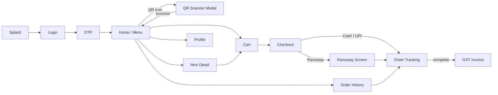
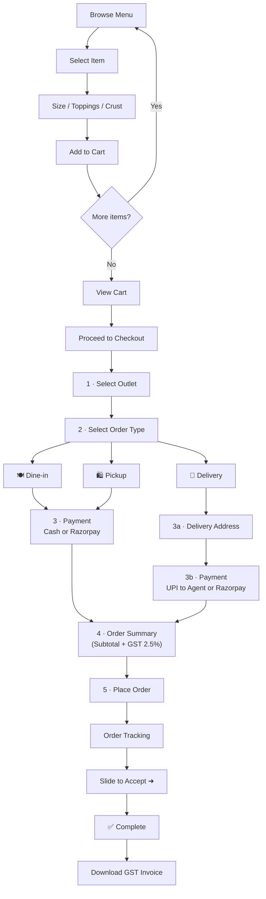
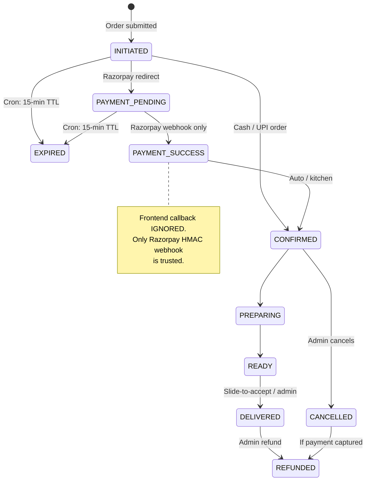
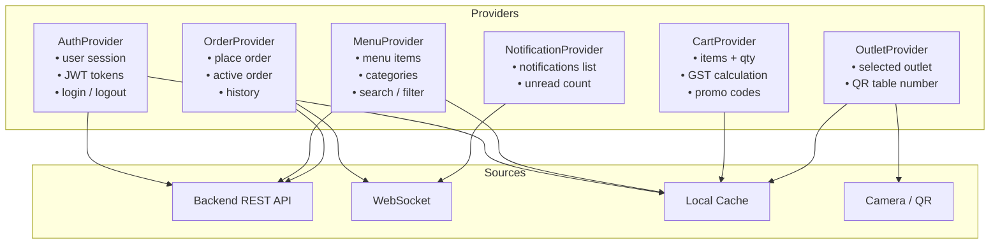

# Fresco's Kitchen — Customer Mobile App

**Version:** 3.0 · **Date:** 6 March 2026 · **Author:** Engineering Team  
**Companion Documents:** [Admin Portal](./admin_portal_system_design.md) · [Backend API](./backend_api_system_design.md) · [Database Schema](./database_schema.md)

---

## Table of Contents

1. [Overview](#1-overview)
2. [Development Approach](#2-development-approach)
3. [Flutter App Architecture](#3-flutter-app-architecture)
4. [Screen Flow & Navigation](#4-screen-flow--navigation)
5. [Checkout Flow — Detailed](#5-checkout-flow--detailed)
6. [Flutter Data Models](#6-flutter-data-models)
7. [State Management](#7-state-management)
8. [Feature Specifications](#8-feature-specifications)
9. [Prototype Reference](#9-prototype-reference)
10. [Performance & Packaging](#10-performance--packaging)
11. [Implementation Roadmap](#11-implementation-roadmap)

---

## 1. Overview

The Fresco's Kitchen Customer Mobile App is a **cross-platform Flutter application** (Android + iOS, single codebase) that enables campus students to browse the menu, customize orders, choose their fulfillment method, pay online or at the store, track orders in real time, and download GST-compliant invoices.

### Key Characteristics

| Aspect | Detail |
|--------|--------|
| **Framework** | Flutter 3.x (Dart) |
| **Platforms** | Android, iOS |
| **Design System** | Material Design 3 (Material You) |
| **Font** | Inter (Google Fonts) |
| **Primary Color** | `#FF6B35` (Fresco's Orange) |
| **State Management** | Provider (ChangeNotifier) |
| **Prototype** | `prototype/index.html` — interactive HTML/JS prototype (approved) |
| **Order Types** | Dine-in · Self Pickup · Delivery |
| **Preparation Time** | 25–30 min (prep) + 10 min for delivery |
| **Payment Methods** | Cash at Store · UPI to Delivery Agent · Razorpay |
| **GST** | CGST 1.25% + SGST 1.25% (2.5% total) |
| **Multi-Outlet** | Customer selects outlet at checkout |
| **QR Ordering** | Table QR scan → auto-sets Dine-in + outlet + table number |

### Menu Data

| Category | Items |
|----------|-------|
| Pizzas | 4 |
| Japanese | 5 |
| Sides | 3 |
| Beverages | 4 |
| Desserts | 4 |
| Combo Meals | 3 |
| **Total** | **23** |

---

## 2. Development Approach

### Phases

| Phase | Description | Status |
|-------|-------------|--------|
| 1 | HTML Prototype (`prototype/index.html`) | ✅ Done — approved |
| 2 | Backend APIs (Node.js/NestJS) | 🔄 In progress |
| 3 | Flutter App — replace mock data with live APIs | ⏳ Planned |
| 4 | Production build + app store release | ⏳ Planned |

### Project Structure

```
campus_food_ordering_system/
├── prototype/
│   ├── index.html        # Customer app prototype (approved)
│   ├── app.js
│   └── styles.css
├── lib/                  # Flutter source
│   ├── core/
│   ├── data/
│   ├── models/
│   ├── providers/
│   └── screens/
└── docs/
```

---

## 3. Flutter App Architecture

### 3.1 App Layers

```
┌──────────────────────────────────────────┐
│           UI Layer (Screens)             │
│  Splash → Login → OTP → Home → Detail → │
│  Cart → Checkout → Tracking → Invoice   │
├──────────────────────────────────────────┤
│        State Layer (Providers)           │
│  AuthProvider · MenuProvider ·           │
│  CartProvider · OrderProvider ·          │
│  OutletProvider · NotificationProvider   │
├──────────────────────────────────────────┤
│        Service Layer                     │
│  ApiService · WebSocketService ·         │
│  CacheService · QRScannerService ·       │
│  RazorpayService · InvoiceService        │
├──────────────────────────────────────────┤
│        Core Layer (Shared)               │
│  AppTheme · AppColors · AppSpacing ·     │
│  Constants · Utils · WhatsAppHelper      │
└──────────────────────────────────────────┘
```

### 3.2 File Structure

```
lib/
├── app.dart                              # MyApp root (MultiProvider)
├── main.dart                             # Entry: runApp(MyApp())
├── injection_container.dart              # Dependency injection
├── core/
│   ├── constants/
│   │   ├── app_colors.dart               # Color constants
│   │   └── app_spacing.dart              # Spacing tokens xs→xxxl
│   ├── theme/
│   │   └── app_theme.dart                # Material3 ThemeData
│   └── utils/
│       ├── whatsapp_helper.dart          # WhatsApp URL launcher
│       └── gst_calculator.dart           # CGST/SGST calculation
├── data/
│   └── mock_data.dart                    # Temporary: 23 MenuItems
├── models/
│   ├── menu_item.dart
│   ├── cart_item.dart
│   └── order.dart
├── providers/
│   ├── auth_provider.dart
│   ├── menu_provider.dart
│   ├── cart_provider.dart
│   ├── order_provider.dart
│   ├── outlet_provider.dart
│   └── notification_provider.dart
└── screens/
    ├── auth/
    │   ├── splash_screen.dart
    │   ├── login_screen.dart
    │   └── otp_screen.dart
    ├── home/
    │   └── home_screen.dart
    ├── menu/
    │   └── menu_item_detail_screen.dart
    ├── cart/
    │   └── cart_screen.dart
    ├── checkout/
    │   └── checkout_screen.dart
    ├── payment/
    │   └── payment_screen.dart           # Razorpay WebView
    ├── orders/
    │   ├── order_tracking_screen.dart
    │   └── order_history_screen.dart
    ├── profile/
    │   └── profile_screen.dart
    ├── notifications/
    │   └── notification_screen.dart
    └── admin/
        └── admin_screen.dart             # Lightweight mobile admin
```

### 3.3 Dependencies (pubspec.yaml)

```yaml
dependencies:
  flutter: sdk
  provider: ^6.1.2           # State management
  google_fonts: ^6.2.1       # Inter font
  intl: ^0.19.0              # Date/number formatting
  uuid: ^4.5.1               # Order ID generation
  url_launcher: ^6.3.1       # WhatsApp, Razorpay links
  flutter_secure_storage: ^9.0.0   # JWT token storage
  cached_network_image: ^3.3.1     # Menu item images
  mobile_scanner: ^4.0.0     # QR code scanning
  web_socket_channel: ^2.4.0 # Real-time order updates
  http: ^1.2.0               # REST API calls
  razorpay_flutter: ^1.3.6   # Razorpay payment SDK
```

---

## 4. Screen Flow & Navigation

### 4.1 Navigation Graph



### 4.2 Order Fulfillment Flow



### 4.3 Order Status State Machine



**Transitions enforced server-side atomically. Invalid transitions return 422.**

### 4.4 Slide-to-Accept States

| State | Label (Pickup) | Label (Dine-in) | Label (Delivery) |
|-------|---------------|----------------|-----------------|
| Idle | "Slide to Collect ➜" | "Slide to Confirm Dine-in ➜" | "Slide to Accept Delivery ➜" |
| Completed | "✔ Collected!" | "✔ Dine-in Confirmed!" | "✔ Delivered!" |

Threshold: **85%** drag distance → triggers completion. Snaps back if released before.

### 4.5 Order Status → Customer Labels

| Status | Customer Label | Terminal? |
|--------|---------------|----------|
| `initiated` | "🕒 Order Created" | ❌ |
| `payment_pending` | "⏳ Processing Payment..." | ❌ |
| `payment_success` | "✅ Payment Confirmed" | ❌ |
| `confirmed` | "👨‍🍳 Order Confirmed" | ❌ |
| `preparing` | "🍳 Being Prepared" | ❌ |
| `ready` (pickup) | "🛍️ Ready for Pickup" | ❌ |
| `ready` (dinein) | "🍽️ Ready for Dine-in" | ❌ |
| `ready` (delivery) | "🚚 Out for Delivery" | ❌ |
| `delivered` | "✅ Delivered!" | ✅ |
| `cancelled` | "Order Cancelled" | ✅ |
| `refunded` | "💰 Refund Processed" | ✅ |
| `expired` | "Order Expired (unpaid)" | ✅ |

### 4.6 Screen Inventory

| # | Screen | Key Features |
|---|--------|-------------|
| 1 | Splash | Animated logo, 2s auto-navigate |
| 2 | Login | Phone number input, country code |
| 3 | OTP | 6-digit OTP, 30s resend timer |
| 4 | Home / Menu | Category tabs (All/Pizzas/Sides/Japanese/Beverages/Desserts/Combo), search, QR icon, veg badge |
| 5 | QR Scanner | Animated viewfinder, table detection, auto-sets outlet + dine-in |
| 6 | Item Detail | Image, description, size picker (S/M/L), toppings, crust, qty stepper, dynamic price |
| 7 | Cart | Item list, qty ±, delivery charge (₹30 if < ₹500), promo code, GST lines, grand total |
| 8 | Checkout | Outlet → Order type → Address (delivery only) → Payment → Order summary |
| 9 | Razorpay | UPI / Card / Net Banking payment screen |
| 10 | Order Tracking | Status stepper, ETA, type-aware labels, slide-to-accept, invoice button |
| 11 | Order History | Past orders list, status badge, reorder button |
| 12 | Profile | Edit name/phone, saved addresses, favorites, FAQ |
| 13 | Notifications | Promo alerts, order updates |
| 14 | GST Invoice | Printable PDF — GSTIN, CGST, SGST, grand total |

---

## 5. Checkout Flow — Detailed

The checkout screen presents these sections **in order**:

### Section 1 — Select Outlet

| Outlet | `outlet_id` |
|--------|------------|
| 📍 Fresco's — Main Campus | `main-campus` |
| 📍 Fresco's — North Block | `north-block` |
| 📍 Fresco's — Central Food Court | `food-court` |

> **QR shortcut**: Scanning a table QR code auto-populates outlet + sets Dine-in + sets table number.

### Section 2 — Select Order Type

| Option | Icon | Address Required | Default Payment |
|--------|------|-----------------|----------------|
| Dine-in | 🍽️ | ❌ | Cash at Store |
| Self Pickup | 🛍️ | ❌ | Cash at Store |
| Delivery | 🚚 | ✅ | UPI to Delivery Agent |

### Section 3 — Delivery Address

Shown **only** when Delivery is selected. Hidden for Dine-in and Pickup.

### Section 4 — Payment Method

Dynamically changes with order type:

| Order Type | Option 1 | Option 2 |
|-----------|----------|----------|
| Dine-in / Pickup | Cash at Store | Razorpay |
| Delivery | UPI to Delivery Agent | Razorpay |

> When order type changes, payment selection auto-resets to default option 1.

### Section 5 — Order Summary + GST

```
Margherita Pizza (Medium) x1 .............. ₹ 249
Extra Cheese topping ...................... ₹  40
──────────────────────────────────────────────────
Subtotal .................................. ₹ 289
Delivery Charge ........................... FREE
CGST (1.25%) .............................. ₹   4
SGST (1.25%) .............................. ₹   4
──────────────────────────────────────────────────
Total (incl. GST) ......................... ₹ 297
```

---

## 6. Flutter Data Models

### 6.1 MenuItem

```dart
class MenuItem {
  final String id;
  final String name;
  final String description;
  final double basePrice;
  final String category;        // 'Pizza', 'Japanese', 'Sides', ...
  final String icon;
  final bool isVeg;
  final bool isAvailable;
  final bool isFeatured;
  final double rating;
  final int ratingCount;
  final List<String> tags;      // ['Bestseller', 'Spicy']
  final int prepTimeMinutes;
  final String? imageUrl;
  final List<SizeOption> sizeOptions;
  final List<ToppingOption> toppingOptions;
  final List<CrustOption> crustOptions;
}

class SizeOption {
  final String id;
  final String label;           // 'Small (7")'
  final String sizeCode;        // 'small' | 'medium' | 'large'
  final double priceAddon;
}

class ToppingOption {
  final String id;
  final String name;            // 'Extra Cheese'
  final double price;
  final bool isVeg;
  final String category;
}

class CrustOption {
  final String id;
  final String label;           // 'Thin Crust'
  final double priceAddon;
}
```

### 6.2 CartItem

```dart
class CartItem {
  final MenuItem menuItem;
  int quantity;
  final SizeOption? selectedSize;
  final List<ToppingOption> selectedToppings;
  final CrustOption? selectedCrust;
  final String? specialInstructions;

  double get unitPrice =>
    menuItem.basePrice
    + (selectedSize?.priceAddon ?? 0)
    + selectedToppings.fold(0.0, (s, t) => s + t.price)
    + (selectedCrust?.priceAddon ?? 0);

  double get totalPrice => unitPrice * quantity;
}
```

### 6.3 Order

```dart
enum OrderStatus {
  initiated,       // Order created, awaiting payment
  paymentPending,  // Redirected to Razorpay
  paymentSuccess,  // Webhook confirmed
  confirmed,       // Kitchen accepted + invoice assigned
  preparing,
  ready,
  delivered,       // Terminal ✅
  cancelled,       // Terminal ✅
  refunded,        // Terminal ✅
  expired          // Terminal ✅ (15-min TTL exceeded)
}

enum OrderType { dineIn, selfPickup, delivery }

enum PaymentMethod { cashAtStore, upiToAgent, razorpay }

class Order {
  final String id;                        // 'PIZ-20260306-0100'
  final String outletId;                  // 'main-campus'
  final String outletName;
  final int? tableNumber;                 // Set for QR dine-in orders
  final List<CartItem> items;
  final double subtotal;
  final double deliveryCharge;            // ₹30 if subtotal < ₹500
  final double cgst;                      // subtotal × 1.25%
  final double sgst;                      // subtotal × 1.25%
  final double discount;
  final double total;
  final OrderStatus status;
  final OrderType orderType;
  final PaymentMethod paymentMethod;
  final String? deliveryAddress;          // Only for delivery
  final String? specialInstructions;
  final DateTime createdAt;
  final DateTime? estimatedReadyTime;
  final DateTime? completedAt;
  final bool isPaid;
}
```

---

## 7. State Management

### 7.1 Provider Architecture



### 7.2 CartProvider — Computed Properties

| Property | Formula |
|----------|---------|
| `subtotal` | Sum of `item.totalPrice` |
| `deliveryCharge` | ₹30 if subtotal < ₹500, else ₹0 |
| `cgst` | `round(subtotal × 0.0125, 2)` |
| `sgst` | `round(subtotal × 0.0125, 2)` |
| `grandTotal` | subtotal + deliveryCharge + cgst + sgst − discount |

### 7.3 CartProvider — Methods

| Method | Behavior |
|--------|---------|
| `addItem(item)` | Add or increment if same item+customizations |
| `removeItem(id)` | Remove line item |
| `updateQuantity(id, qty)` | Set qty; remove if ≤ 0 |
| `applyPromo(code)` | Validate via API, apply discount |
| `clearCart()` | Empty cart post-order |

---

## 8. Feature Specifications

### 8.1 QR-Based Table Ordering

| Step | Action |
|------|--------|
| 1 | Tap QR icon in home screen top bar |
| 2 | Camera opens with animated scanner viewfinder |
| 3 | Scan table QR code (outlet + table embedded) |
| 4 | Toast: "Table #7 linked — Dine-in mode set!" |
| 5 | On checkout: Outlet + Order type pre-filled; table number sent with order |

### 5.3 Menu Customization (Pizza)

| Option | UI | Notes |
|--------|-----|-------|
| Size | Radio (S/M/L) | Adds ₹0 / ₹50 / ₹100 |
| Crust | Radio | Thin (₹0), Thick (₹20), Stuffed (₹50) |
| Toppings | Checkboxes | Multi-select; individual prices |
| Quantity | Stepper | Min 1 |
| Instructions | Text field | Free-form cooking notes |

> Dynamic price updates in real-time as options change.

### 5.4 Payment Flows

**Cash at Store / UPI to Agent (Cash orders)**
- Order created: `initiated` → auto-advances to `confirmed` (no payment gate)
- Staff manually marks paid via admin portal

**Razorpay (Online payment)**
- Order created: `initiated`
- POST `/payments/razorpay/create` → get Razorpay order ID → status → `payment_pending`
- Customer completes UPI / Card / Net Banking in Razorpay SDK
- Razorpay sends **webhook** to server (HMAC SHA256 verified)
- Server atomically: `payment_pending` → `payment_success` → `confirmed`, invoice assigned
- **Frontend payment callback is ignored.** Poll `GET /orders/:id` until status = `confirmed`

### 5.5 GST Invoice

Available on the Order Tracking screen after `confirmed` status:

| Invoice Field | Value |
|--------------|-------|
| Invoice Number | `{OUTLET_CODE}-{FY}-{SEQUENCE}` e.g. `IITH-FY26-000145` |
| GSTIN | Per-outlet (e.g. `29AABCF1234C1Z5`) |
| Outlet Name & Address | From outlet selection |
| Table Number | Shown if QR order |
| Items | Name, qty, rate, amount |
| Subtotal | Pre-tax |
| CGST @ 1.25% | Computed |
| SGST @ 1.25% | Computed |
| Grand Total | All-inclusive |
| Print / Download | Browser print or PDF download |
| Credit Note | Generated if order is `refunded` |

### 8.5 Order Type Behaviour Summary

| Type | Address? | Payment default | Tracking label | Slide text |
|------|----------|----------------|----------------|-----------|
| Dine-in | ❌ | Cash at Store | "Ready for Dine-in 🍽️" | "Slide to Confirm Dine-in ➜" |
| Pickup | ❌ | Cash at Store | "Ready for Pickup 🛍️" | "Slide to Collect ➜" |
| Delivery | ✅ | UPI to Agent | "Out for Delivery 🚚" | "Slide to Accept Delivery ➜" |

### 8.6 Notifications

| Trigger | Channel | Message |
|---------|---------|---------|
| Order placed | FCM + WhatsApp | Confirmation with ETA |
| Order confirmed | FCM | "Kitchen started preparing your order" |
| Order ready | FCM + WhatsApp | Type-appropriate ready message |
| Delivery dispatched | FCM | "Your order is on the way!" |
| Payment confirmed | FCM | "Payment of ₹XXX received" |

### 8.7 Profile Features

- Edit name and phone
- Saved delivery addresses (hostel/building)
- Favorites list with quick ADD button
- Order history with reorder button
- Help / FAQ
- About Fresco's Kitchen

---

## 9. Prototype Reference

The approved HTML prototype is the **source of truth** for UI/UX during Flutter development.

| File | Purpose |
|------|---------|
| `prototype/index.html` | All screens and navigation in one file |
| `prototype/app.js` | State management, checkout logic, GST calc, QR sim, Razorpay sim, invoice gen |
| `prototype/styles.css` | Full design system: colors, typography, components, animations |

### Key Prototype Functions to Mirror in Flutter

| Prototype Function | Flutter Equivalent |
|-------------------|-------------------|
| `onOrderTypeChange()` | `OrderProvider.setOrderType()` + rebuild checkout |
| `onPaymentMethodChange()` | `CartProvider.setPaymentMethod()` |
| `onOutletChange()` | `OutletProvider.selectOutlet()` |
| `renderCheckoutSummary()` | `CheckoutScreen._buildSummary()` with GST lines |
| `getGrandTotal()` | `CartProvider.grandTotal` getter |
| `simulateQRScan()` | `QRScannerService.applyTableScan()` |
| `downloadInvoice()` | `InvoiceService.generateAndOpen()` |
| `confirmOrder()` | `OrderProvider.placeOrder()` |

---

## 10. Performance & Packaging

| Concern | Strategy |
|---------|---------|
| App startup | Lazy-load heavy screens; cache menu on first load |
| Images | `cached_network_image` with skeleton placeholder |
| API calls | Response caching via Redis; debounced search (300ms) |
| Real-time | WebSocket with exponential backoff reconnect |
| Offline | Show cached menu and order history from local DB |
| Bundle size | Tree-shake unused icons; defer Razorpay SDK |
| Accessibility | Semantic labels on all interactive elements |

### Build Targets

```bash
# Android APK
flutter build apk --release

# Android App Bundle (Play Store)
flutter build appbundle --release

# iOS (requires macOS)
flutter build ios --release
```

---

## 11. Implementation Roadmap

| Phase | Milestone | Dependencies |
|-------|-----------|-------------|
| ✅ 0 | HTML Prototype approved | — |
| 🔄 1 | Backend Auth module live | — |
| 🔄 2 | Backend Menu & Outlets live | Phase 1 |
| 🔄 3 | Flutter — Auth screens (Login, OTP, Splash) | Phase 1 |
| 🔄 4 | Flutter — Home & Item Detail (live menu) | Phase 2 |
| 🔄 5 | Flutter — Cart with GST calculation | Phase 2 |
| 🔄 6 | Backend — Orders + Payments live | Phase 1,2 |
| 🔄 7 | Flutter — Checkout (outlet, order type, payment) | Phase 3,6 |
| 🔄 8 | Flutter — Razorpay SDK integration | Phase 6 |
| 🔄 9 | Flutter — Order Tracking with WebSocket | Phase 6 |
| 🔄 10 | Flutter — GST Invoice (PDF/print) | Phase 6 |
| 🔄 11 | Flutter — QR Scanner (mobile_scanner) | Phase 2 |
| 🔄 12 | Flutter — Profile, History, Notifications | Phase 1,6 |
| 🔄 13 | App Store / Play Store release | All phases |
