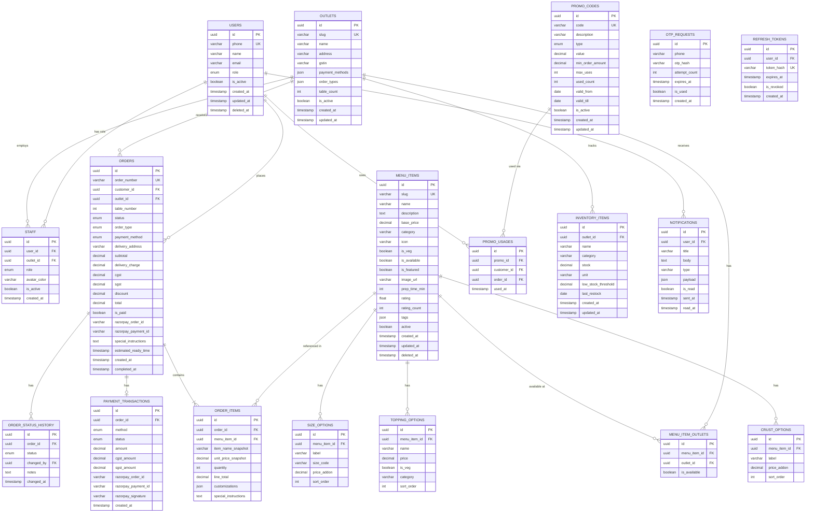
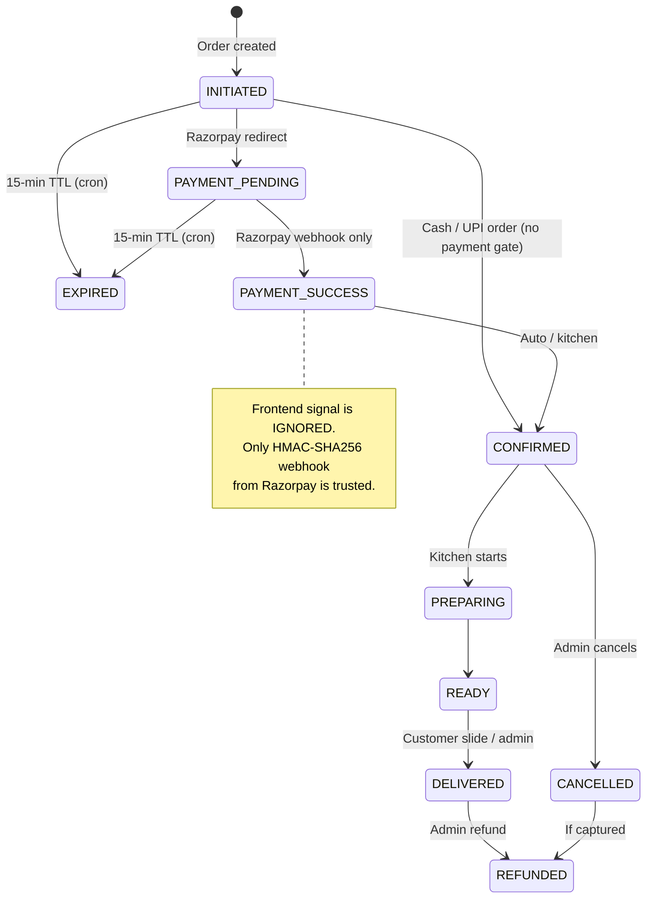

# Fresco's Kitchen — Database Schema

**Version:** 1.0 · **Date:** 6 March 2026 · **Author:** Engineering Team  
**Companion Documents:** [Backend API](./backend_api_system_design.md) · [Admin Portal](./admin_portal_system_design.md) · [Customer App](./customer_app_system_design.md)

---

## Table of Contents

1. [Overview](#1-overview)
2. [Entity Relationship Diagram](#2-entity-relationship-diagram)
3. [Table Definitions](#3-table-definitions)
4. [Indexes](#4-indexes)
5. [Materialized Views](#5-materialized-views)
6. [Enums](#6-enums)
7. [Seed Data](#7-seed-data)
8. [Migration Strategy](#8-migration-strategy)

---

## 1. Overview

| Attribute | Value |
|-----------|-------|
| **Database** | PostgreSQL 15+ |
| **ORM** | TypeORM (NestJS) or Prisma |
| **Connection** | SSL encrypted |
| **Timezone** | UTC (stored); convert to IST in API layer |
| **IDs** | UUID v4 (all primary keys) |
| **Soft Delete** | `deleted_at` timestamp (nullable) — no hard deletes |
| **Audit** | `created_at`, `updated_at` on every table |
| **GST** | CGST 1.25% + SGST 1.25% stored as computed columns |

---

## 2. Entity Relationship Diagram



---

## 3. Table Definitions

### 3.1 users

```sql
CREATE TABLE users (
    id              UUID PRIMARY KEY DEFAULT gen_random_uuid(),
    phone           VARCHAR(15) UNIQUE NOT NULL,       -- '+91XXXXXXXXXX'
    name            VARCHAR(100),
    email           VARCHAR(255),
    role            user_role NOT NULL DEFAULT 'customer',
    is_active       BOOLEAN NOT NULL DEFAULT TRUE,
    created_at      TIMESTAMPTZ NOT NULL DEFAULT NOW(),
    updated_at      TIMESTAMPTZ NOT NULL DEFAULT NOW(),
    deleted_at      TIMESTAMPTZ                        -- soft delete
);
```

### 3.2 outlets

```sql
CREATE TABLE outlets (
    id               UUID PRIMARY KEY DEFAULT gen_random_uuid(),
    slug             VARCHAR(60) UNIQUE NOT NULL,      -- 'main-campus'
    name             VARCHAR(100) NOT NULL,
    address          TEXT,
    gstin            VARCHAR(20),                      -- '29AABCF1234C1Z5'
    payment_methods  JSONB NOT NULL DEFAULT '["cash_at_store","upi_to_agent","razorpay"]',
    order_types      JSONB NOT NULL DEFAULT '["dinein","pickup","delivery"]',
    table_count      INT NOT NULL DEFAULT 20,
    is_active        BOOLEAN NOT NULL DEFAULT TRUE,
    created_at       TIMESTAMPTZ NOT NULL DEFAULT NOW(),
    updated_at       TIMESTAMPTZ NOT NULL DEFAULT NOW()
);
```

### 3.3 staff

```sql
CREATE TABLE staff (
    id            UUID PRIMARY KEY DEFAULT gen_random_uuid(),
    user_id       UUID NOT NULL REFERENCES users(id),
    outlet_id     UUID REFERENCES outlets(id),         -- NULL = all outlets
    role          staff_role NOT NULL,
    avatar_color  VARCHAR(10) DEFAULT '#FF6B35',
    is_active     BOOLEAN NOT NULL DEFAULT TRUE,
    created_at    TIMESTAMPTZ NOT NULL DEFAULT NOW()
);
```

### 3.4 menu_items

```sql
CREATE TABLE menu_items (
    id              UUID PRIMARY KEY DEFAULT gen_random_uuid(),
    slug            VARCHAR(100) UNIQUE NOT NULL,       -- 'margherita-pizza'
    name            VARCHAR(100) NOT NULL,
    description     TEXT,
    base_price      DECIMAL(10,2) NOT NULL,
    category        VARCHAR(50) NOT NULL,               -- 'Pizza','Japanese','Sides',...
    icon            VARCHAR(50) DEFAULT 'restaurant',
    is_veg          BOOLEAN NOT NULL DEFAULT TRUE,
    is_available    BOOLEAN NOT NULL DEFAULT TRUE,
    is_featured     BOOLEAN NOT NULL DEFAULT FALSE,
    image_url       TEXT,
    prep_time_min   INT NOT NULL DEFAULT 20,
    rating          FLOAT NOT NULL DEFAULT 0.0,
    rating_count    INT NOT NULL DEFAULT 0,
    tags            JSONB DEFAULT '[]',                 -- ["Bestseller","Spicy"]
    active          BOOLEAN NOT NULL DEFAULT TRUE,
    created_at      TIMESTAMPTZ NOT NULL DEFAULT NOW(),
    updated_at      TIMESTAMPTZ NOT NULL DEFAULT NOW(),
    deleted_at      TIMESTAMPTZ
);
```

### 3.5 menu_item_outlets

```sql
CREATE TABLE menu_item_outlets (
    id             UUID PRIMARY KEY DEFAULT gen_random_uuid(),
    menu_item_id   UUID NOT NULL REFERENCES menu_items(id) ON DELETE CASCADE,
    outlet_id      UUID NOT NULL REFERENCES outlets(id) ON DELETE CASCADE,
    is_available   BOOLEAN NOT NULL DEFAULT TRUE,
    UNIQUE (menu_item_id, outlet_id)
);
```

### 3.6 size_options / topping_options / crust_options

```sql
CREATE TABLE size_options (
    id              UUID PRIMARY KEY DEFAULT gen_random_uuid(),
    menu_item_id    UUID NOT NULL REFERENCES menu_items(id) ON DELETE CASCADE,
    label           VARCHAR(50) NOT NULL,               -- 'Small (7")'
    size_code       VARCHAR(20) NOT NULL,               -- 'small','medium','large'
    price_addon     DECIMAL(10,2) NOT NULL DEFAULT 0,
    sort_order      INT NOT NULL DEFAULT 0
);

CREATE TABLE topping_options (
    id              UUID PRIMARY KEY DEFAULT gen_random_uuid(),
    menu_item_id    UUID NOT NULL REFERENCES menu_items(id) ON DELETE CASCADE,
    name            VARCHAR(100) NOT NULL,              -- 'Extra Cheese'
    price           DECIMAL(10,2) NOT NULL,
    is_veg          BOOLEAN NOT NULL DEFAULT TRUE,
    category        VARCHAR(50),                        -- 'cheese','meat','veggies'
    sort_order      INT NOT NULL DEFAULT 0
);

CREATE TABLE crust_options (
    id              UUID PRIMARY KEY DEFAULT gen_random_uuid(),
    menu_item_id    UUID NOT NULL REFERENCES menu_items(id) ON DELETE CASCADE,
    label           VARCHAR(50) NOT NULL,               -- 'Thin Crust'
    price_addon     DECIMAL(10,2) NOT NULL DEFAULT 0,
    sort_order      INT NOT NULL DEFAULT 0
);
```

### 3.7 orders

```sql
CREATE TABLE orders (
    id                      UUID PRIMARY KEY DEFAULT gen_random_uuid(),
    order_number            VARCHAR(30) UNIQUE NOT NULL,  -- 'PIZ-20260306-0100'
    invoice_number          VARCHAR(30) UNIQUE,           -- {OUTLET_CODE}-{FY}-{SEQUENCE} e.g. IITH-FY26-000145
    customer_id             UUID NOT NULL REFERENCES users(id),
    customer_name           VARCHAR(100),                 -- Captured for QR guest orders
    customer_whatsapp       VARCHAR(15),                  -- For QR guest orders
    outlet_id               UUID NOT NULL REFERENCES outlets(id),
    table_number            INT,                          -- Set for QR dine-in orders
    status                  order_status NOT NULL DEFAULT 'initiated',
    order_type              order_type NOT NULL,
    payment_method          payment_method NOT NULL,
    delivery_address        TEXT,                         -- Only for delivery orders
    subtotal                DECIMAL(10,2) NOT NULL,
    delivery_charge         DECIMAL(10,2) NOT NULL DEFAULT 0,
    cgst                    DECIMAL(10,2) NOT NULL DEFAULT 0,  -- subtotal × 1.25%
    sgst                    DECIMAL(10,2) NOT NULL DEFAULT 0,  -- subtotal × 1.25%
    discount                DECIMAL(10,2) NOT NULL DEFAULT 0,
    total                   DECIMAL(10,2) NOT NULL,
    is_paid                 BOOLEAN NOT NULL DEFAULT FALSE,
    idempotency_key         VARCHAR(64) UNIQUE,           -- Prevents duplicate order creation
    razorpay_order_id       VARCHAR(60),
    razorpay_payment_id     VARCHAR(60),
    razorpay_webhook_payload JSONB,                       -- Raw webhook for audit
    refund_amount           DECIMAL(10,2),                -- For partial refunds
    refund_razorpay_id      VARCHAR(60),
    special_instructions    TEXT,
    estimated_ready_time    TIMESTAMPTZ,
    expires_at              TIMESTAMPTZ,                  -- Set at INITIATED; cleared on PAYMENT_PENDING
    created_at              TIMESTAMPTZ NOT NULL DEFAULT NOW(),
    completed_at            TIMESTAMPTZ,

    -- Constraints
    CONSTRAINT chk_total CHECK (total = subtotal + delivery_charge + cgst + sgst - discount),
    CONSTRAINT chk_delivery_address CHECK (
        order_type != 'delivery' OR delivery_address IS NOT NULL
    )
);

-- Auto-generate order number trigger
CREATE SEQUENCE order_seq START 100;
-- In trigger: 'PIZ-' || TO_CHAR(NOW(), 'YYYYMMDD') || '-' || LPAD(nextval('order_seq')::TEXT, 4, '0')
```

### 3.7a invoice_sequences

Per-outlet, per-financial-year invoice counter. Supports format: `{OUTLET_CODE}-{FY}-{SEQUENCE}`  
Example: `IITH-FY26-000145` (sequence resets each financial year).

```sql
CREATE TABLE invoice_sequences (
    id              UUID PRIMARY KEY DEFAULT gen_random_uuid(),
    outlet_id       UUID NOT NULL REFERENCES outlets(id),
    financial_year  VARCHAR(10) NOT NULL,  -- 'FY26' = Apr 2025 – Mar 2026
    last_sequence   INT NOT NULL DEFAULT 0,
    updated_at      TIMESTAMPTZ NOT NULL DEFAULT NOW(),
    UNIQUE (outlet_id, financial_year)
);

-- Function to atomically get + increment the sequence number
CREATE OR REPLACE FUNCTION next_invoice_number(p_outlet_id UUID, p_outlet_code VARCHAR)
RETURNS VARCHAR AS $$
DECLARE
    v_fy      VARCHAR(10);
    v_seq     INT;
    v_invoice VARCHAR(30);
BEGIN
    -- Determine current financial year (Apr–Mar)
    v_fy := 'FY' || TO_CHAR(
        CASE WHEN EXTRACT(MONTH FROM NOW()) >= 4 THEN EXTRACT(YEAR FROM NOW())
             ELSE EXTRACT(YEAR FROM NOW()) - 1 END + 1, 'FM00'
    );

    -- Atomic increment (upsert)
    INSERT INTO invoice_sequences (outlet_id, financial_year, last_sequence)
    VALUES (p_outlet_id, v_fy, 1)
    ON CONFLICT (outlet_id, financial_year)
    DO UPDATE SET last_sequence = invoice_sequences.last_sequence + 1,
                 updated_at    = NOW()
    RETURNING last_sequence INTO v_seq;

    v_invoice := p_outlet_code || '-' || v_fy || '-' || LPAD(v_seq::TEXT, 6, '0');
    RETURN v_invoice;
END;
$$ LANGUAGE plpgsql;
```

### 3.8 order_items

```sql
CREATE TABLE order_items (
    id                      UUID PRIMARY KEY DEFAULT gen_random_uuid(),
    order_id                UUID NOT NULL REFERENCES orders(id) ON DELETE CASCADE,
    menu_item_id            UUID REFERENCES menu_items(id) ON DELETE SET NULL,
    item_name_snapshot      VARCHAR(100) NOT NULL,  -- Preserved even if item deleted
    unit_price_snapshot     DECIMAL(10,2) NOT NULL, -- Price at time of order
    quantity                INT NOT NULL DEFAULT 1,
    line_total              DECIMAL(10,2) NOT NULL,
    customizations          JSONB DEFAULT '{}',     -- {size, crust, toppings:[]}
    special_instructions    TEXT
);
```

### 3.9 order_status_history

```sql
CREATE TABLE order_status_history (
    id            UUID PRIMARY KEY DEFAULT gen_random_uuid(),
    order_id      UUID NOT NULL REFERENCES orders(id) ON DELETE CASCADE,
    status        order_status NOT NULL,
    changed_by    UUID REFERENCES users(id),        -- NULL = system
    notes         TEXT,
    changed_at    TIMESTAMPTZ NOT NULL DEFAULT NOW()
);
```

### 3.10 payment_transactions

```sql
CREATE TABLE payment_transactions (
    id                    UUID PRIMARY KEY DEFAULT gen_random_uuid(),
    order_id              UUID NOT NULL REFERENCES orders(id) ON DELETE CASCADE,
    method                payment_method NOT NULL,
    status                txn_status NOT NULL DEFAULT 'pending',
    amount                DECIMAL(10,2) NOT NULL,
    cgst_amount           DECIMAL(10,2) NOT NULL DEFAULT 0,
    sgst_amount           DECIMAL(10,2) NOT NULL DEFAULT 0,
    razorpay_order_id     VARCHAR(60),
    razorpay_payment_id   VARCHAR(60),
    razorpay_signature    VARCHAR(255),
    created_at            TIMESTAMPTZ NOT NULL DEFAULT NOW()
);
```

### 3.11 promo_codes

```sql
CREATE TABLE promo_codes (
    id                UUID PRIMARY KEY DEFAULT gen_random_uuid(),
    code              VARCHAR(30) UNIQUE NOT NULL,
    description       TEXT,
    type              promo_type NOT NULL,           -- 'percentage','fixed','free_delivery','bogo'
    value             DECIMAL(10,2) NOT NULL DEFAULT 0,
    min_order_amount  DECIMAL(10,2) NOT NULL DEFAULT 0,
    max_uses          INT,                           -- NULL = unlimited
    used_count        INT NOT NULL DEFAULT 0,
    valid_from        DATE NOT NULL DEFAULT CURRENT_DATE,
    valid_till        DATE NOT NULL,
    is_active         BOOLEAN NOT NULL DEFAULT TRUE,
    created_at        TIMESTAMPTZ NOT NULL DEFAULT NOW(),
    updated_at        TIMESTAMPTZ NOT NULL DEFAULT NOW()
);

CREATE TABLE promo_usages (
    id             UUID PRIMARY KEY DEFAULT gen_random_uuid(),
    promo_id       UUID NOT NULL REFERENCES promo_codes(id),
    customer_id    UUID NOT NULL REFERENCES users(id),
    order_id       UUID NOT NULL REFERENCES orders(id),
    used_at        TIMESTAMPTZ NOT NULL DEFAULT NOW(),
    UNIQUE (promo_id, customer_id)  -- One use per customer per promo
);
```

### 3.12 inventory_items

```sql
CREATE TABLE inventory_items (
    id                   UUID PRIMARY KEY DEFAULT gen_random_uuid(),
    outlet_id            UUID NOT NULL REFERENCES outlets(id),
    name                 VARCHAR(100) NOT NULL,
    category             VARCHAR(50) NOT NULL,
    stock                DECIMAL(10,2) NOT NULL DEFAULT 0,
    unit                 VARCHAR(20) NOT NULL,         -- 'kg','pcs','L','bunches'
    low_stock_threshold  DECIMAL(10,2) NOT NULL DEFAULT 10,
    last_restock         DATE,
    created_at           TIMESTAMPTZ NOT NULL DEFAULT NOW(),
    updated_at           TIMESTAMPTZ NOT NULL DEFAULT NOW()
);
```

### 3.13 notifications

```sql
CREATE TABLE notifications (
    id          UUID PRIMARY KEY DEFAULT gen_random_uuid(),
    user_id     UUID NOT NULL REFERENCES users(id) ON DELETE CASCADE,
    title       VARCHAR(150) NOT NULL,
    body        TEXT NOT NULL,
    type        VARCHAR(50) NOT NULL,    -- 'order_update','promo','system'
    payload     JSONB DEFAULT '{}',      -- { orderId, status, etc. }
    is_read     BOOLEAN NOT NULL DEFAULT FALSE,
    sent_at     TIMESTAMPTZ NOT NULL DEFAULT NOW(),
    read_at     TIMESTAMPTZ
);
```

### 3.14 otp_requests

```sql
CREATE TABLE otp_requests (
    id             UUID PRIMARY KEY DEFAULT gen_random_uuid(),
    phone          VARCHAR(15) NOT NULL,
    otp_hash       VARCHAR(255) NOT NULL,   -- bcrypt hash of OTP
    attempt_count  INT NOT NULL DEFAULT 0,
    expires_at     TIMESTAMPTZ NOT NULL,    -- 10 minutes from creation
    is_used        BOOLEAN NOT NULL DEFAULT FALSE,
    created_at     TIMESTAMPTZ NOT NULL DEFAULT NOW()
);
```

### 3.15 refresh_tokens

```sql
CREATE TABLE refresh_tokens (
    id           UUID PRIMARY KEY DEFAULT gen_random_uuid(),
    user_id      UUID NOT NULL REFERENCES users(id) ON DELETE CASCADE,
    token_hash   VARCHAR(255) UNIQUE NOT NULL,  -- SHA-256 of refresh token
    expires_at   TIMESTAMPTZ NOT NULL,
    is_revoked   BOOLEAN NOT NULL DEFAULT FALSE,
    created_at   TIMESTAMPTZ NOT NULL DEFAULT NOW()
);
```

---

## 4. Indexes

```sql
-- Users
CREATE INDEX idx_users_phone ON users(phone);
CREATE INDEX idx_users_role ON users(role) WHERE deleted_at IS NULL;

-- Orders — most queried table
CREATE INDEX idx_orders_customer ON orders(customer_id);
CREATE INDEX idx_orders_outlet ON orders(outlet_id);
CREATE INDEX idx_orders_status ON orders(status);
CREATE INDEX idx_orders_order_type ON orders(order_type);
CREATE INDEX idx_orders_created_at ON orders(created_at DESC);
CREATE INDEX idx_orders_outlet_status ON orders(outlet_id, status);
CREATE INDEX idx_orders_date ON orders(DATE(created_at));  -- for daily reports

-- Order items
CREATE INDEX idx_order_items_order ON order_items(order_id);
CREATE INDEX idx_order_items_menu_item ON order_items(menu_item_id);

-- Menu items
CREATE INDEX idx_menu_items_category ON menu_items(category) WHERE active = TRUE;
CREATE INDEX idx_menu_items_featured ON menu_items(is_featured) WHERE active = TRUE;

-- Notifications
CREATE INDEX idx_notifications_user ON notifications(user_id, is_read, sent_at DESC);

-- OTP (cleanup old records)
CREATE INDEX idx_otp_phone ON otp_requests(phone, created_at DESC);
CREATE INDEX idx_otp_expires ON otp_requests(expires_at) WHERE is_used = FALSE;

-- Inventory low-stock query
CREATE INDEX idx_inventory_outlet ON inventory_items(outlet_id);
```

---

## 5. Materialized Views

### 5.1 Daily Revenue (mv_daily_revenue)

```sql
CREATE MATERIALIZED VIEW mv_daily_revenue AS
SELECT
    outlet_id,
    DATE(created_at AT TIME ZONE 'Asia/Kolkata') AS date,
    EXTRACT(HOUR FROM created_at AT TIME ZONE 'Asia/Kolkata') AS hour,
    COUNT(*) AS order_count,
    SUM(subtotal) AS subtotal,
    SUM(cgst) AS cgst_collected,
    SUM(sgst) AS sgst_collected,
    SUM(total) AS gross_revenue,
    AVG(total) AS avg_order_value
FROM orders
WHERE status NOT IN ('cancelled', 'refunded', 'expired')
GROUP BY outlet_id, DATE(created_at AT TIME ZONE 'Asia/Kolkata'),
         EXTRACT(HOUR FROM created_at AT TIME ZONE 'Asia/Kolkata');

CREATE UNIQUE INDEX ON mv_daily_revenue(outlet_id, date, hour);
```

### 5.2 Monthly Revenue (mv_monthly_revenue)

```sql
CREATE MATERIALIZED VIEW mv_monthly_revenue AS
SELECT
    outlet_id,
    DATE_TRUNC('month', created_at) AS period,
    COUNT(*) AS order_count,
    SUM(subtotal) AS subtotal,
    SUM(cgst) AS cgst_collected,
    SUM(sgst) AS sgst_collected,
    SUM(total) AS gross_revenue,
    AVG(total) AS avg_order_value
FROM orders
WHERE status NOT IN ('cancelled', 'refunded', 'expired')
GROUP BY outlet_id, DATE_TRUNC('month', created_at);

CREATE UNIQUE INDEX ON mv_monthly_revenue(outlet_id, period);
```

### 5.3 Top Menu Items (mv_top_items)

```sql
CREATE MATERIALIZED VIEW mv_top_items AS
SELECT
    oi.menu_item_id,
    oi.item_name_snapshot AS name,
    COUNT(*) AS times_ordered,
    SUM(oi.quantity) AS total_qty,
    SUM(oi.line_total) AS total_revenue,
    DATE_TRUNC('month', o.created_at) AS period
FROM order_items oi
JOIN orders o ON oi.order_id = o.id
WHERE o.status NOT IN ('cancelled', 'refunded', 'expired')
GROUP BY oi.menu_item_id, oi.item_name_snapshot, DATE_TRUNC('month', o.created_at);

CREATE UNIQUE INDEX ON mv_top_items(menu_item_id, period);
```

### 5.4 GST Summary (mv_gst_summary)

```sql
CREATE MATERIALIZED VIEW mv_gst_summary AS
SELECT
    o.outlet_id,
    out.gstin,
    DATE_TRUNC('month', o.created_at) AS period,
    COUNT(*) AS invoice_count,
    SUM(o.subtotal) AS taxable_amount,
    SUM(o.cgst) AS cgst_collected,
    SUM(o.sgst) AS sgst_collected,
    SUM(o.cgst + o.sgst) AS total_gst_collected,
    SUM(o.total) AS gross_revenue
FROM orders o
JOIN outlets out ON o.outlet_id = out.id
WHERE o.status IN ('delivered')   -- Only count fully completed paid orders
GROUP BY o.outlet_id, out.gstin, DATE_TRUNC('month', o.created_at);

CREATE UNIQUE INDEX ON mv_gst_summary(outlet_id, period);
```

### 5.5 Refresh Schedule (pg_cron)

```sql
-- Refresh every hour
SELECT cron.schedule('refresh-daily-revenue',   '0 * * * *', 'REFRESH MATERIALIZED VIEW CONCURRENTLY mv_daily_revenue');
SELECT cron.schedule('refresh-monthly-revenue', '5 * * * *', 'REFRESH MATERIALIZED VIEW CONCURRENTLY mv_monthly_revenue');
SELECT cron.schedule('refresh-top-items',       '10 * * * *','REFRESH MATERIALIZED VIEW CONCURRENTLY mv_top_items');
SELECT cron.schedule('refresh-gst-summary',     '15 * * * *','REFRESH MATERIALIZED VIEW CONCURRENTLY mv_gst_summary');
```

---

## 6. Enums

```sql
-- User roles
CREATE TYPE user_role AS ENUM ('customer', 'cashier', 'kitchen', 'delivery', 'admin', 'super_admin');

-- Staff roles (subset of user_role for admin portal)
CREATE TYPE staff_role AS ENUM ('cashier', 'kitchen', 'delivery', 'admin', 'super_admin');

-- Order lifecycle — Strict State Machine (10 states)
-- Transitions are ATOMIC — no partial updates allowed.
CREATE TYPE order_status AS ENUM (
    'initiated',          -- Order created, awaiting payment redirect
    'payment_pending',    -- Redirected to Razorpay, awaiting webhook
    'payment_success',    -- Webhook confirmed payment (NOT frontend signal)
    'confirmed',          -- Kitchen accepted the order
    'preparing',          -- Kitchen actively preparing food
    'ready',              -- Food ready (pickup / dine-in / out for delivery)
    'delivered',          -- Terminal: food received by customer
    'cancelled',          -- Terminal: cancelled before PREPARING
    'refunded',           -- Terminal: payment reversed (partial or full)
    'expired'             -- Terminal: payment not completed within TTL window
);

-- Valid state transitions (enforced in service layer + DB trigger)
-- initiated       → payment_pending  (customer redirected to Razorpay)
-- initiated       → confirmed        (cash/UPI orders skip payment states)
-- initiated       → expired          (cron job: 15-min TTL on unpaid Razorpay orders)
-- payment_pending → payment_success  (ONLY via Razorpay webhook HMAC SHA256)
-- payment_pending → expired          (cron job: 15-min TTL)
-- payment_success → confirmed        (auto or admin action)
-- confirmed       → preparing        (kitchen action)
-- confirmed       → cancelled        (admin can cancel before preparing)
-- preparing       → ready
-- ready           → delivered        (customer slide-to-accept OR admin action)
-- delivered       → refunded         (admin initiates refund)
-- cancelled       → refunded         (if payment was already captured)

-- How the customer wants to receive the order
CREATE TYPE order_type AS ENUM ('dinein', 'pickup', 'delivery');

-- How the customer pays
CREATE TYPE payment_method AS ENUM ('cash_at_store', 'upi_to_agent', 'razorpay');

-- Transaction state
CREATE TYPE txn_status AS ENUM (
    'initiated',    -- Razorpay order created
    'pending',      -- Awaiting webhook
    'captured',     -- Webhook confirmed: payment_success
    'failed',       -- Payment failed or declined
    'refunded',     -- Full refund issued
    'partial_refund' -- Partial refund issued
);

-- Promo code discount types
CREATE TYPE promo_type AS ENUM ('percentage', 'fixed', 'free_delivery', 'bogo');
```

### 6.1 State Machine Diagram



---

## 7. Seed Data

```sql
-- Outlets
INSERT INTO outlets (slug, name, address, gstin, table_count) VALUES
  ('main-campus',  'Fresco''s — Main Campus',       'Ground Floor, Main Building', '29AABCF1234C1Z5', 20),
  ('north-block',  'Fresco''s — North Block',        'North Block Canteen Area',    '29AABCF1234C1Z5', 12),
  ('food-court',   'Fresco''s — Central Food Court', 'Central Food Court, Level 2', '29AABCF1234C1Z5', 30);

-- Super Admin user
INSERT INTO users (phone, name, role) VALUES ('+919876543210', 'Sanni Kumar', 'super_admin');

-- Promo Codes
INSERT INTO promo_codes (code, description, type, value, min_order_amount, valid_till) VALUES
  ('PIZZABOGO',    'Buy 1 Get 1 Free on medium pizzas', 'bogo',       0,   299,  '2026-03-31'),
  ('WELCOME30',    'Flat 30% off first order',           'percentage', 30,  0,    '2026-12-31'),
  ('COMBO100',     '₹100 off combos above ₹599',        'fixed',      100, 599,  '2026-04-15'),
  ('FREEDELIVERY', 'Free delivery on all orders',        'free_delivery', 0, 0,  '2026-03-07');
```

---

## 8. Migration Strategy

### 8.1 Tool

Use **TypeORM migrations** (NestJS) or **Prisma Migrate**:

```bash
# TypeORM
npx typeorm migration:generate src/migrations/InitSchema
npx typeorm migration:run

# Prisma
npx prisma migrate dev --name init_schema
npx prisma db seed
```

### 8.2 Migration Order

```
1_create_enums.sql
2_create_users.sql
3_create_outlets.sql
4_create_staff.sql
5_create_menu_items.sql
6_create_menu_item_outlets.sql
7_create_size_topping_crust_options.sql
8_create_orders.sql
9_create_order_items.sql
10_create_order_status_history.sql
11_create_payment_transactions.sql
12_create_promo_codes.sql
13_create_inventory_items.sql
14_create_notifications.sql
15_create_otp_requests.sql
16_create_refresh_tokens.sql
17_create_indexes.sql
18_create_materialized_views.sql
19_seed_data.sql
```

### 8.3 Cleanup Jobs (pg_cron)

```sql
-- Delete expired OTPs older than 24 hours
SELECT cron.schedule('cleanup-otps', '0 2 * * *',
  'DELETE FROM otp_requests WHERE expires_at < NOW() - INTERVAL ''24 hours''');

-- Revoke expired refresh tokens older than 60 days
SELECT cron.schedule('cleanup-tokens', '0 3 * * *',
  'DELETE FROM refresh_tokens WHERE expires_at < NOW() - INTERVAL ''60 days''');

-- Delete read notifications older than 30 days
SELECT cron.schedule('cleanup-notifications', '0 4 * * *',
  'DELETE FROM notifications WHERE is_read = TRUE AND read_at < NOW() - INTERVAL ''30 days''');
```
